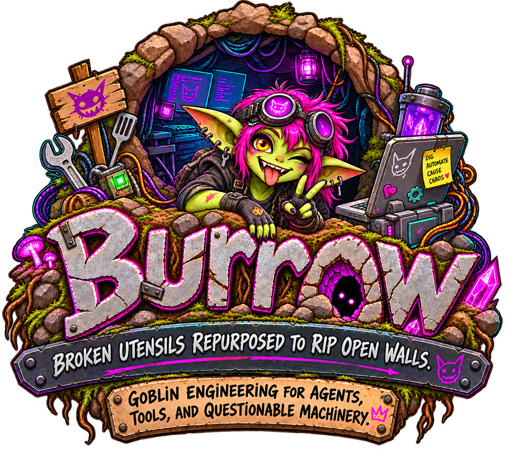

# Burrow

> [!WARNING]
> Burrow does not provide guardrails for every tool action or external integration. Run it only where you understand the credentials, systems, and data it can reach—and the blast radius of an agent acting with that access. Start with least privilege, isolated test targets, and deliberate integration grants.

<p align="center">
  
</p>

> A chat-first local runtime for people who want capable agents without turning their workbench into a dashboard cult.

Burrow keeps conversation first. Tools, traces, receipts, tasks, and debug data stay behind the curtain unless they are useful to inspect.

## Project scope

Burrow is a public personal project, built around the maintainer's own needs and direction. Issues and thoughtful feedback are welcome and will be read, but opening an issue does not create an obligation to implement it. Changes that do not fit the project's vision may be declined or left unaddressed.

Burrow is assembled from two human-edited source repositories:

- **[Burrow-Backend](https://github.com/NightShaman/Burrow-Backend)** → `backend/`
- **[Burrow-UI](https://github.com/NightShaman/Burrow-UI)** → `ui/`

`backend/` and `ui/` are tracked snapshots, not submodules and not primary development locations. Each assembly records its exact source commits in `SOURCE_VERSIONS`.

## Install

Burrow installs into one self-contained user home, `~/.burrow` by default:

```sh
curl -fsSL https://raw.githubusercontent.com/NightShaman/Burrow/main/install.sh | sh
```

To install elsewhere, download the script first and pass `--dir`:

```sh
curl -fsSLO https://raw.githubusercontent.com/NightShaman/Burrow/main/install.sh
sh install.sh --dir "$HOME/my-burrow"
```

The installer downloads the assembled `main` revision, installs dependencies, builds the bundled UI, and creates:

```text
~/.burrow/
├── app/          # replaceable installed application
├── bin/burrow    # launcher and management command
├── burrow.env    # durable runtime environment
├── config/        # settings database and configuration
├── workspace/     # workspace and project material
├── agentdata/     # sessions and agent-local runtime state
├── cache/
├── reports/
└── integrations/
```

Node.js, npm, `curl`, and `tar` must be available. The installer does not require `/opt`, root access, or Docker.

### Options

```text
--dir PATH                    install root; defaults to ~/.burrow
--headless                    install runtime without bundled UI assets
--no-install-dependencies     skip npm install/build; development use only
--source-dir PATH             install from an assembled local Burrow checkout
--help                        show all options
```

## Run and update

Start Burrow:

```sh
~/.burrow/bin/burrow serve
```

The default listener is `127.0.0.1:42817`. Edit `~/.burrow/burrow.env` to change the runtime environment.

Update in place:

```sh
~/.burrow/bin/burrow update
```

An update downloads the current assembled Burrow revision and atomically replaces only `~/.burrow/app`. It preserves `burrow.env`, `config/`, `workspace/`, `agentdata/`, `cache/`, `reports/`, and `integrations/`.

### Run as a user service

On Linux hosts with systemd user services, install and start a persistent service:

```sh
~/.burrow/bin/burrow service install
```

It creates `~/.config/systemd/user/burrow.service`, enables it, and starts it. Management commands are:

```sh
~/.burrow/bin/burrow service status
~/.burrow/bin/burrow service restart
~/.burrow/bin/burrow service logs
~/.burrow/bin/burrow service stop
~/.burrow/bin/burrow service start
~/.burrow/bin/burrow service uninstall
```

The service uses `~/.burrow/burrow.env` and starts `~/.burrow/bin/burrow serve`. It restarts after failures and is persistent across logout and reboot: installation requires `loginctl` to enable and verify systemd user lingering for the installing account. If lingering or systemd user services are unavailable, service installation fails rather than creating a session-only service; run `burrow serve` under your own supervisor for that case.

## Uninstall

Remove the application while preserving all durable state:

```sh
~/.burrow/bin/burrow uninstall
```

The command prompts before removing `app/` and the launcher. To remove the entire Burrow home, including configuration, workspace, sessions, and other durable state:

```sh
~/.burrow/bin/burrow uninstall --purge
```

For non-interactive use, include `--yes` explicitly:

```sh
~/.burrow/bin/burrow uninstall --purge --yes
```

## Docker

The published image stores all durable runtime state in `/data`. The supplied Compose file binds the UI to loopback because Burrow has no UI authentication by default.

```sh
git clone https://github.com/NightShaman/Burrow.git
cd Burrow
docker compose up -d
```

Open <http://127.0.0.1:42817>. To expose Burrow beyond the local host, do not simply change the port binding: put it behind a trusted reverse proxy or configure authentication first, then review the credentials, systems, and data the runtime can reach.

To build the exact checked-out deployment payload instead of pulling the published image:

```sh
docker build -t burrow:local .
docker run --init --rm -p 127.0.0.1:42817:42817 -v burrow-data:/data burrow:local
```

Docker packaging is canonical in Burrow-Backend under `deploy/docker/`. A successful generated assembly materializes the root `Dockerfile`, `docker-entrypoint.sh`, `compose.yml`, and `.dockerignore`, then builds `ghcr.io/nightshaman/burrow` from that exact generated commit.

## Generated integration policy

`Burrow` is generated output. Human source changes belong in `Burrow-Backend` or `Burrow-UI`; the next assembly can overwrite generated snapshots.

After a verified source push, `.github/workflows/assemble.yml`:

1. resolves the triggering source revision and the configured revision of the other source;
2. tests the backend and UI, builds the UI, and writes immutable source SHAs to `SOURCE_VERSIONS`;
3. commits the assembled application, installer, and Docker assets to `main`;
4. builds and publishes `ghcr.io/nightshaman/burrow:sha-<Burrow commit>` and `ghcr.io/nightshaman/burrow:latest` from that generated commit.

The assembly requires a `BURROW_SOURCE_TOKEN` repository secret to fetch the source repositories and publish the image. Source repositories use `BURROW_DISPATCH_TOKEN` to request an assembly after their own verification succeeds.

## Mods

Mods are separate from the Burrow product repository. Install them beneath the active runtime root, normally `~/.burrow/mods/<mod-id>`, and restart Burrow after installation. Burrow discovers a mod from its `burrow.mod.json` manifest.

For example, Remote Nodes is maintained at <https://github.com/NightShaman/burrow-mod-remote-nodes>:

```sh
mkdir -p "$HOME/.burrow/mods"
git clone https://github.com/NightShaman/burrow-mod-remote-nodes.git \
  "$HOME/.burrow/mods/remote-nodes"
```
