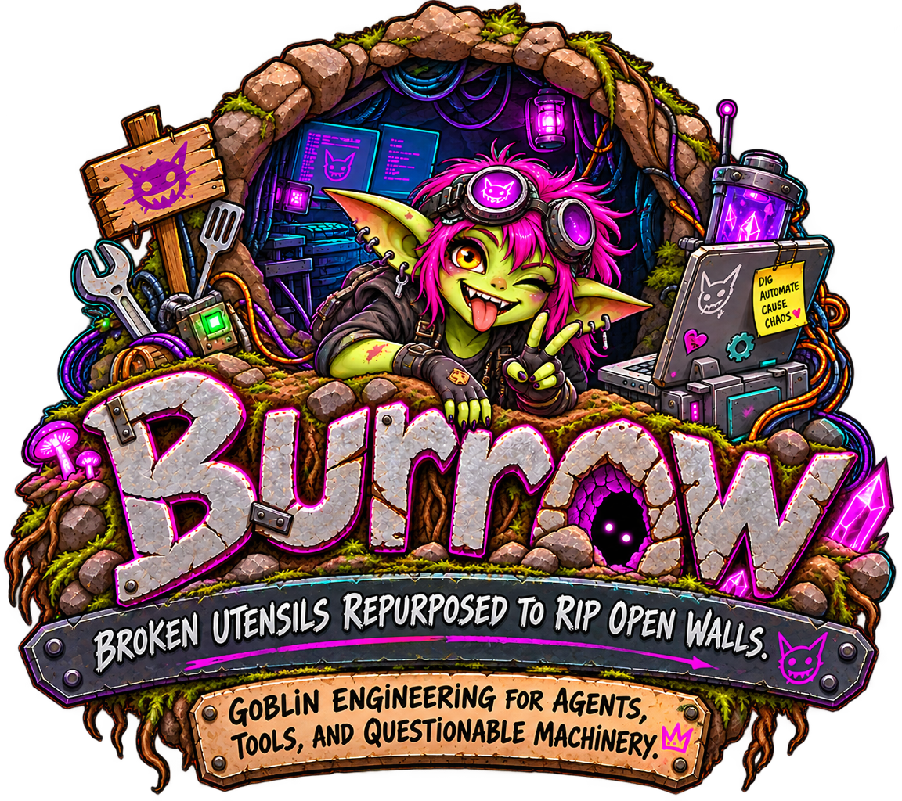

# Burrow

> [!WARNING]
> **Burrow is not safe by default and does not provide comprehensive guardrails around agent actions.**
>
> Agents can use every tool and integration you grant them, including access to files, credentials, remote systems, and external services. Burrow assumes the operator understands and accepts that blast radius. Use least-privilege credentials, isolated test targets, and only the integrations you deliberately intend to expose.

<p align="center">
  
</p>

> A chat-first local runtime for people who want capable agents without turning their workbench into a dashboard cult.

Burrow keeps conversation first. Tools, traces, receipts, tasks, and debug data stay behind the curtain unless they are useful to inspect.

## Install

> **Before installing:** Burrow's safety boundary is the access you grant it, not an internal command sandbox. Do not run it with credentials or host permissions whose full blast radius you are unwilling to accept.

Burrow installs into one self-contained user home, `~/.burrow` by default:

```sh
curl -fsSL https://raw.githubusercontent.com/NightShaman/Burrow/main/install.sh | sh
```

The complete automatic setup path is Ubuntu with systemd, run as a non-root user with sudo access. Have `curl`, `tar`, and gzip support available; the installer provisions Node.js 24 with npm when needed, plus missing PostgreSQL 17 and pgvector packages for the default managed database. It creates and starts a persistent user service and verifies HTTP readiness and the installed version before reporting success. Burrow itself runs as your user; it does not require `/opt` or Docker.

Node provisioning also supports RHEL-family Linux 9+, but automatic PostgreSQL/pgvector provisioning is Ubuntu-only. On other hosts, supply the database prerequisites yourself or configure an external PostgreSQL 17 server in `burrow.env`. Use `--no-service` for a foreground runtime or your own supervisor.

To install elsewhere, download the script first and pass `--dir`:

```sh
curl -fsSLO https://raw.githubusercontent.com/NightShaman/Burrow/main/install.sh
sh install.sh --dir "$HOME/my-burrow"
```

The installer downloads the assembled `main` revision, installs dependencies, builds the bundled UI, and creates:

```text
~/.burrow/
├── app/          # replaceable installed application
├── bin/burrow    # launcher and management command
├── burrow.env    # durable runtime environment
├── config/       # settings database and configuration
├── workspace/    # workspace and project material
├── cache/
├── reports/
└── integrations/
```

### Installer options

```text
--dir PATH                    install root; defaults to ~/.burrow
--host HOST                   listener host; defaults to 127.0.0.1
--port PORT                   listener port; defaults to 42817
--no-service                  skip automatic service setup; foreground/custom supervisor
--install-node                compatibility alias; Node provisioning is already automatic
--no-install-dependencies     skip npm install/build and auto service; development only
--source-dir PATH             install from an assembled local Burrow checkout
--help                        show all options
```

## Run and update

A fresh default install is already running. Check its status:

```sh
~/.burrow/bin/burrow service status
```

For an installation made with `--no-service`, start it in the foreground with `~/.burrow/bin/burrow serve`. Do not run a foreground process alongside the service on the same port.

The default listener is `127.0.0.1:42817`. Configure it explicitly during unattended installation, for example `sh install.sh --host 0.0.0.0 --port 42817`. Re-running the installer without listener flags preserves the existing values; supplying either flag updates that value and restarts a managed service after activation.

Update in place:

```sh
~/.burrow/bin/burrow update
```

An update downloads the current assembled Burrow revision and atomically replaces only `~/.burrow/app`. It preserves `burrow.env`, `config/`, `workspace/`, `cache/`, `reports/`, and `integrations/`. Existing managed services are updated/restarted without re-enabling a disabled service; existing manual installations remain manual.

### Run as a user service

Fresh default installs set up the persistent service automatically. To opt into it later after a manual installation, run:

```sh
~/.burrow/bin/burrow service install
```

Management commands are:

```sh
~/.burrow/bin/burrow service status
~/.burrow/bin/burrow service restart
~/.burrow/bin/burrow service logs
~/.burrow/bin/burrow service stop
~/.burrow/bin/burrow service start
~/.burrow/bin/burrow service uninstall
```

The service uses `~/.burrow/burrow.env`, restarts after failures, and persists across logout and reboot. Installation requires `loginctl` to enable and verify systemd user lingering, with a sudo fallback if enabling it as your user is denied. If lingering or systemd user services are unavailable, service installation fails rather than creating a session-only service; install with `--no-service` and run `burrow serve` under your own supervisor instead.

## Docker

The published image stores durable runtime state in `/data` and runs as UID/GID `4226:4226` by default.

Create `compose.yml`:

```yaml
services:
  burrow:
    image: ghcr.io/nightshaman/burrow:latest
    pull_policy: always
    init: true
    user: "4226:4226"
    environment:
      HOME: /home/burrow
    restart: unless-stopped
    ports:
      - "42817:42817"
      - "7443:7443"
    volumes:
      - burrow-data:/data

volumes:
  burrow-data:
```

Then start it:

```sh
docker compose up -d
```

Open `http://<docker-host>:42817`. These port mappings are reachable through the Docker host; restrict them with the host firewall, network policy, or a trusted reverse proxy. TCP `7443` is used by approved Node Goblin execution nodes.

The persistent volume must be writable by the configured numeric identity. Migrate existing Burrow-owned data deliberately rather than recursively changing unrelated container or service data.

To build from source for development instead, clone this repository and use its root `Dockerfile`.

## Mods

Mods are optional projects maintained separately from Burrow. Their repositories contain their installation, configuration, and update instructions.

- **[Node Goblin](https://github.com/NightShaman/Node-Goblin)** — run approved Burrow tools on remote machines.

## Uninstall

Remove the application while preserving durable state:

```sh
~/.burrow/bin/burrow uninstall
```

Remove the entire Burrow home, including configuration, workspace, sessions, and other durable state:

```sh
~/.burrow/bin/burrow uninstall --purge
```

For non-interactive use, include `--yes` explicitly:

```sh
~/.burrow/bin/burrow uninstall --purge --yes
```

## Project status

Burrow is a public personal project built around the maintainer's own needs and direction. Issues and thoughtful feedback are welcome and will be read, but opening an issue does not create an obligation to implement it. Changes that do not fit the project's vision may be declined or left unaddressed.
