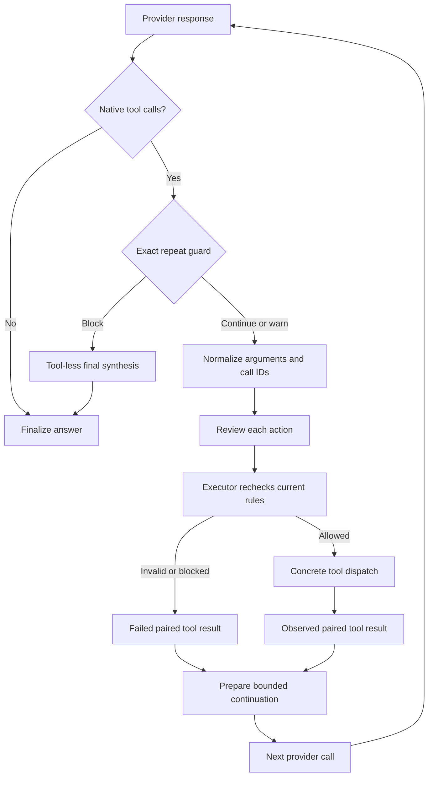

# Execution flow

This page follows a selected native tool call through validation, dispatch, provider continuation, and terminal reporting. For setup and tool arguments, see [Tools](../concepts/tools.md).

## From model output to execution

Native call IDs remain runtime metadata. The executor returns one result for every provider call, including malformed or denied calls, so a model can repair arguments without corrupting the provider's tool protocol. [Source: native action normalization](https://github.com/NightShaman/Burrow/blob/d6490825401405ce719e007fd96a487c5b0cde56/backend/src/action-proposal.mjs#L447-L492) [Source: call/result pairing](https://github.com/NightShaman/Burrow/blob/d6490825401405ce719e007fd96a487c5b0cde56/backend/src/runtime-orchestrator.mjs#L112-L160)

## Validation is repeated at dispatch

An earlier review is a receipt, not trusted authority forever. The concrete executor checks parser errors and operator-configured hard blocks again. Integration calls additionally resolve an enabled connection and grant; mod-backed tools recheck the live registry and grants at invocation time.

This catches changes between discovery, model selection, and execution. It does not turn arbitrary installed code into a sandbox. [Source: executor boundary](https://github.com/NightShaman/Burrow/blob/d6490825401405ce719e007fd96a487c5b0cde56/backend/src/proposal-executor.mjs#L78-L92) [Source: live mod grant check](https://github.com/NightShaman/Burrow/blob/d6490825401405ce719e007fd96a487c5b0cde56/backend/src/proposal-executor.mjs#L303-L322)

## Local and remote dispatch

Process and supported native filesystem routers use immutable target facts. Remote operation identity is derived from parent-run and provider-tool-call identifiers. Protected values are passed separately from ordinary command text.

For local minions, the parent writes a private temporary payload, starts the child Node process, and captures bounded stdout/stderr tails. The child emits progress and a distinct terminal JSON sentinel. The parent records the final receipt and removes temporary payload material. For remote-assigned minions, the runner stays in-process to retain the trusted execution controller. [Source: process router](https://github.com/NightShaman/Burrow/blob/d6490825401405ce719e007fd96a487c5b0cde56/backend/src/process-execution-router.mjs#L9-L75) [Source: child process protocol](https://github.com/NightShaman/Burrow/blob/d6490825401405ce719e007fd96a487c5b0cde56/backend/src/subagent-process-runner.mjs#L18-L145)

## Bound memory without ending useful work

Tool implementations own raw outputs. The loop retains compact calls, receipts, and evidence projections; the original result graph is released after the adapter serializes the native continuation. Histories are bounded independently of how many useful iterations can execute.

Exact repeated call-and-result streaks produce a warning and then a block using configured thresholds. The default helper thresholds correspond to warning on the second attempted identical call and blocking on the third. A repeated call whose observed outcome changes is different from an unchanged exact repeat. Semantic inspection-stall telemetry is observational rather than a separate universal stop rule. [Source: loop ownership](https://github.com/NightShaman/Burrow/blob/d6490825401405ce719e007fd96a487c5b0cde56/backend/src/runtime-orchestrator.mjs#L426-L511) [Source: repeat detector](https://github.com/NightShaman/Burrow/blob/d6490825401405ce719e007fd96a487c5b0cde56/backend/src/tool-loop-detection.mjs#L71-L158)

When native continuation is supported, the runtime preserves protocol pairs and supplies prepared messages. Otherwise it uses an explicit evidence-based follow-up prompt. A terminal repeat block performs a tool-less synthesis that must distinguish executed results from skipped calls. [Source: continuation and synthesis](https://github.com/NightShaman/Burrow/blob/d6490825401405ce719e007fd96a487c5b0cde56/backend/src/runtime-orchestrator.mjs#L527-L633)

## What gets persisted

Finalization separates several outcomes:

1. Persist generated artifact bytes, then keep only normalized storage metadata
2. Store canonical tool-call/result entries as debug data
3. Store a compact execution digest for continuity and activity for presentation
4. Store the assistant's user-visible answer
5. Persist bounded run evidence and a compact receipt reference
6. Commit terminal state under the session's continuity generation

An empty answer after tool use becomes `incomplete`. The transcript must not silently claim a finished task merely because tools ran. [Source: finalizer](https://github.com/NightShaman/Burrow/blob/d6490825401405ce719e007fd96a487c5b0cde56/backend/src/runtime-plain-chat-finalizer.mjs#L252-L330)

## Verification is a separate claim

Normal chat collects tool outcomes and structured completion evidence. It does not automatically execute every legacy work-loop verification/commit gate.

The retained work-loop verification helper looks for a successful model call, a mutation artifact, a passing check, no failed checks, and overlap with a changed target. Its recognized mutation/check types are limited. For example, `files_edit` support differs between newer evidence helpers and legacy verification. A successful write is therefore not interchangeable with “verified,” and a successful check should identify what it checked. [Source: verification policy](https://github.com/NightShaman/Burrow/blob/d6490825401405ce719e007fd96a487c5b0cde56/backend/src/verification.mjs#L36-L138) [Source: compatibility runner gates](https://github.com/NightShaman/Burrow/blob/d6490825401405ce719e007fd96a487c5b0cde56/backend/src/runner.mjs#L281-L378)

## Failure and cancellation semantics

| Observation | Interpretation |
|---|---|
| Invalid/blocked tool result | That call did not execute; the model can choose a valid next step |
| Failed command | Inspect exit status, stdout/stderr, and any earlier effects |
| Failed multi-file patch | Earlier file operations may already have applied |
| Provider continuation failure | Earlier tools may have succeeded; reconcile their receipts |
| Superseded terminal result | Another run owns the session; no stale answer should become current |
| Cancellation | Abort is requested; do not assume previously completed side effects were rolled back |
| Minion prose without terminal signal | Not a completed child result |

The runtime is not a transaction manager for arbitrary shell commands, remote systems, or multi-tool work. Recovery must reconcile observed effects. [Known limitations](../project/known-limitations.md) records static wiring and edge-path concerns; [Troubleshooting](../operations/troubleshooting.md) explains operational diagnosis.
