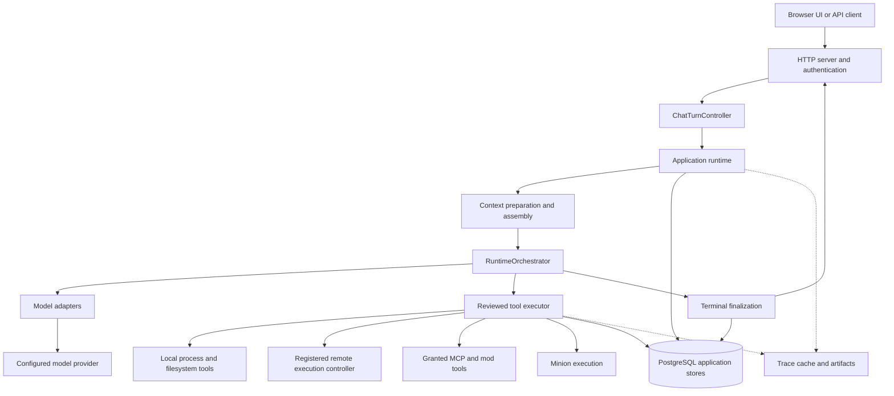

# Architecture overview

BURROW separates the operator surface, runtime orchestration, authoritative state, execution placement, and provider transport. This keeps the conversational interface small while preserving inspectable evidence for work performed behind it.

## Component map

The HTTP entrypoint is `backend/scripts/burrow-ui.mjs`; transport normalization is in `chat-turn-controller.mjs`; `app-runtime.mjs` composes the turn. The model/tool loop belongs to `runtime-orchestrator.mjs`. [Source: controller boundary](https://github.com/NightShaman/Burrow/blob/d6490825401405ce719e007fd96a487c5b0cde56/backend/src/chat-turn-controller.mjs#L1-L17) [Source: runtime composition](https://github.com/NightShaman/Burrow/blob/d6490825401405ce719e007fd96a487c5b0cde56/backend/src/app-runtime.mjs#L1-L38)

## Ownership boundaries

| Component | Owns | Must not be mistaken for |
|---|---|---|
| UI / HTTP transport | Input, authentication, response/stream presentation | Model or tool authority |
| Application runtime | Turn preparation, trusted agent context, continuity ownership, terminal coordination | A prose classifier that automatically grants actions |
| Context builder | Selection and provider-ready context assembly | A second durable conversation store |
| Runtime orchestrator | Model calls and native tool continuations | UI rendering or deployment management |
| Model adapter | Provider serialization, stream decoding, normalized response | Conversation persistence |
| Tool executor | Concrete dispatch and execution-time validation | A promise that every requested action ran |
| PostgreSQL stores | Configuration and current conversation/state authorities | Trace files or release contents |
| Runtime filesystem | Workspaces, artifacts, trace/cache files, release material | Universal settings or conversation authority |

Normal chat fixes the route as a model-owned chat turn. Planning and route metadata are diagnostic/support information, not an independent execution engine. [Source: route ownership](https://github.com/NightShaman/Burrow/blob/d6490825401405ce719e007fd96a487c5b0cde56/backend/src/app-runtime.mjs#L299-L351)

## State root versus execution root

The controller must retain its agent/session state even when tools execute elsewhere. A remote assignment therefore changes the execution target, not the owner of PostgreSQL conversations or profile configuration. Each tool result can carry execution origin and correlation identifiers.

Three selections have different meanings:

| Selection | Changes | Does not establish |
|---|---|---|
| UI API target | Which runtime owns target-aware HTTP requests and resources | That every UI request moves off the local origin |
| Agent execution environment | Local execution, or a remote `providerId`/`targetId` for supported tools | A new agent identity or a migration of controller-owned state |
| Filesystem target / command `cwd` | The directory used as task context or a command's working directory | Host choice, permission grants, or OS containment |

An execution host, sometimes called a node by an integration, is an execution placement. It is not a registered agent or minion. The core router requires a live registered controller for a remote target; an unavailable controller fails the operation rather than falling back to the controller host. Provider-specific host discovery, enrollment, and transport belong to that integration's contract. [Source: target and process routing](https://github.com/NightShaman/Burrow/blob/d6490825401405ce719e007fd96a487c5b0cde56/backend/src/process-execution-router.mjs#L15-L47) [Source: UI target transport](https://github.com/NightShaman/Burrow/blob/d6490825401405ce719e007fd96a487c5b0cde56/ui/src/app/api.ts#L340-L414)

See [Interface runtime ownership](../concepts/interface.md#runtime-and-resource-ownership) and [Agent execution environments](../concepts/agents-minions.md#execution-environment) before operating across multiple runtimes or hosts.

Agent workspace and target paths establish context and defaults. They do not create a filesystem sandbox. [Source: execution facts](https://github.com/NightShaman/Burrow/blob/d6490825401405ce719e007fd96a487c5b0cde56/backend/src/execution-context.mjs#L44-L116)

See [Persistence](persistence.md), [Trust boundaries](../security/trust-boundaries.md), and [Tools](../concepts/tools.md).

## Conversation versus observability

The current conversation is authoritative for what was said. Provider messages are a prepared projection, not a byte-for-byte copy of every stored event.

The runtime keeps separate channels for:

- Chat-visible user, assistant, and attributed agent messages
- Activity events for useful progress
- Tool calls/results and compact execution digests
- Receipts and debug information
- Raw diagnostic artifacts

Raw receipts, tool protocol, and debug entries do not all become future conversation. The finalizer deliberately adds a bounded execution digest when appropriate. [Source: persisted tool and digest entries](https://github.com/NightShaman/Burrow/blob/d6490825401405ce719e007fd96a487c5b0cde56/backend/src/runtime-plain-chat-finalizer.mjs#L158-L219)

## Extension boundaries

Skills extend instructions; MCP and mod capabilities extend tool availability; model adapters extend provider contracts. These are separate responsibilities. A skill cannot grant an unconfigured tool, and a discovered tool is not necessarily granted.

See [Extensions](../development/extensions.md), [MCP](../concepts/mcp.md), and [Models](../concepts/models.md).

## Read the architecture in depth

- [Runtime and context](runtime.md): how a turn is prepared and committed
- [Execution flow](execution-flow.md): tool dispatch, continuations, cancellation, and verification
- [Persistence](persistence.md): authoritative stores and data lifecycle
- [Source map](../project/source-map.md): repository layout and source ownership
- [Known limitations](../project/known-limitations.md): observed implementation gaps, separate from intended contracts
