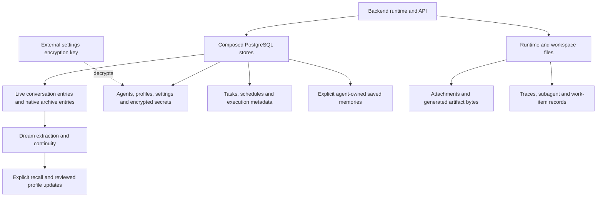
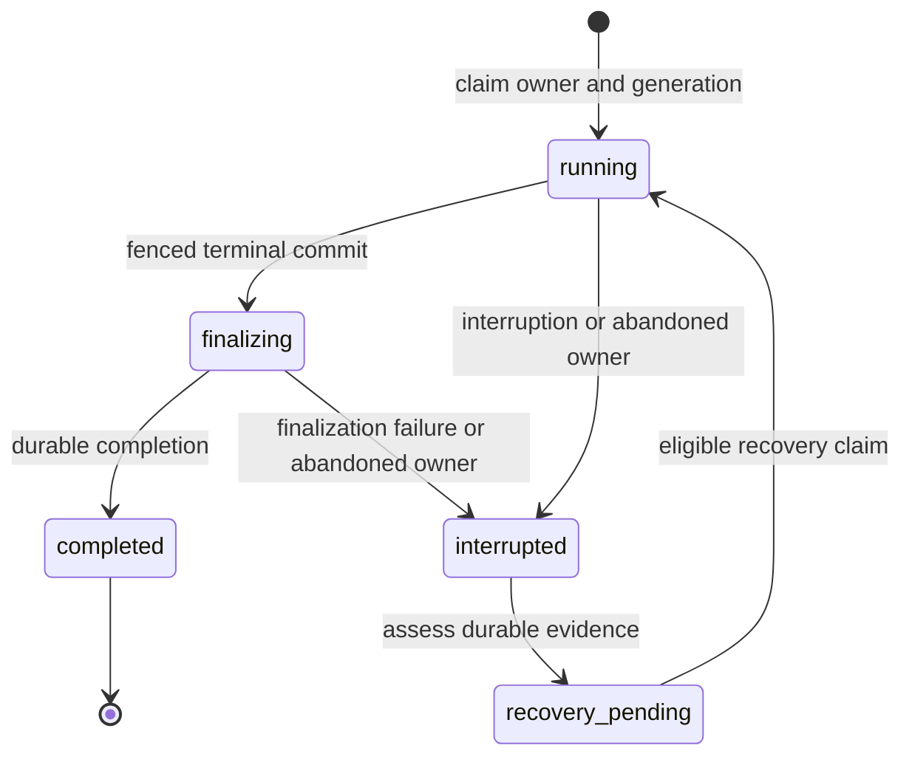

# Persistence architecture

BURROW uses PostgreSQL for application settings, conversation history, memory and execution metadata. File attachments, generated artifacts, traces and several worker records remain on disk. A recoverable installation therefore includes both database and filesystem state, plus the key that decrypts stored credentials.

This page describes the storage boundaries. For installation commands, see [Deployment](../operations/deployment.md); for recovery procedures, see [Backup and recovery](../operations/backup-recovery.md).

## Data ownership

The application composes its PostgreSQL stores around one owned or borrowed pool. Original messages remain evidence authority. Brains stores deliberately saved, agent-owned memories separately; legacy Albdruck tables remain for compatibility and migration, not as an active operator API. The composition also validates and applies pending schema migrations. [Store composition](https://github.com/NightShaman/Burrow/blob/d6490825401405ce719e007fd96a487c5b0cde56/backend/src/postgres-composition.mjs#L32-L98)

| Data | Authority | Important boundary |
|---|---|---|
| Active messages | `conversation_entries` | Original payloads use PostgreSQL `json` |
| Archived message occurrences | `conversation_archive_entries` with `conversation_archives` headers | Compaction and reset preserve earlier originals |
| Original-history lookup | `conversation_original_rows` view | Read-only union over the two native payload stores |
| Agent identity and profiles | `agents`, `agent_profile_documents` | File-like profile references are virtual PostgreSQL references |
| Settings and credentials | Typed settings tables and metadata stores | Secret values are encrypted using an external key |
| Knowledge and continuity | Brains, working memory, rolling continuity, Dream and handoff stores | Saved memories and derived context do not replace original evidence |
| Attachment and generated bytes | Agent workspace `artifacts/` directories | A database backup alone does not contain these bytes |
| Worker and work-item records | Runtime data directories | File-backed records have different locking semantics from PostgreSQL |

See [Storage schema](../reference/storage-schema.md) for table ownership and [Conversation history](../concepts/conversation-history.md) for original-message semantics. Native archive storage is defined by [migrations 19–21](https://github.com/NightShaman/Burrow/blob/d6490825401405ce719e007fd96a487c5b0cde56/backend/src/postgres-session-store.mjs#L270-L499).

## PostgreSQL lifecycle

`BURROW_POSTGRES_LIFECYCLE` selects `managed` or `external`; `BURROW_POSTGRES_MODE` is a compatibility fallback. An unset lifecycle resolves to `disabled`, which startup rejects. It does not select another database backend. [Lifecycle configuration](https://github.com/NightShaman/Burrow/blob/d6490825401405ce719e007fd96a487c5b0cde56/backend/src/postgres-lifecycle-bootstrap.mjs#L13-L32), [startup](https://github.com/NightShaman/Burrow/blob/d6490825401405ce719e007fd96a487c5b0cde56/backend/src/postgres-startup.mjs#L6-L33)

| Mode | BURROW manages | Requirements and connection behavior |
|---|---|---|
| Managed | Cluster initialization, process start and stop | Runs as a non-root OS user; private Unix socket; data/socket directories mode `0700`; no TCP listener |
| External | Application schema only | Operator supplies an existing PostgreSQL service; startup checks the required major version and installed `vector` extension |

The required PostgreSQL major defaults to **17**. Managed startup uses the current OS user and the `postgres` database over the private socket, overriding generic URL/password settings. External lifecycle validation does not create a database, role or extension and does not stop the external service. [Managed and external lifecycle](https://github.com/NightShaman/Burrow/blob/d6490825401405ce719e007fd96a487c5b0cde56/backend/src/postgres-lifecycle.mjs#L41-L133), [managed connection override](https://github.com/NightShaman/Burrow/blob/d6490825401405ce719e007fd96a487c5b0cde56/backend/src/postgres-startup.mjs#L11-L18)

For an external connection, `BURROW_POSTGRES_URL` takes precedence over `DATABASE_URL`; individual host/port/database/user/password fields are used otherwise. Explicit TLS mode accepts `disable` or `verify-full`; a custom PEM CA is valid only with `verify-full`. Conflicting URL SSL parameters and explicit TLS mode are rejected. Use [Environment reference](../reference/environment.md) for exact variables. [Connection configuration](https://github.com/NightShaman/Burrow/blob/d6490825401405ce719e007fd96a487c5b0cde56/backend/src/postgres-foundation.mjs#L15-L61)

Changing lifecycle mode does not migrate data between clusters. Plan a database transfer and verify its target separately; see [Upgrades](../operations/upgrades.md).

## Migrations and transactions

The current manifest contains **49 append-only migrations**. Each applied version records its name and SQL checksum in `burrow_schema_migrations`. Startup holds a transaction-scoped advisory lock while validating the ledger and applying pending SQL. Unknown versions, gaps, renamed migrations or changed checksums stop migration rather than silently rewriting history. [Manifest](https://github.com/NightShaman/Burrow/blob/c15064dd177788afcdda357a5e545510f754a754/backend/src/postgres-application-schema.mjs), [migration runner](https://github.com/NightShaman/Burrow/blob/d6490825401405ce719e007fd96a487c5b0cde56/backend/src/postgres-migrations.mjs#L14-L64)

Nested transaction work uses savepoints. A nested operation cannot commit the outer transaction; rollback failure causes the client to be discarded. Per-domain locks add narrower guarantees: session appends lock the session row, Tiddle writes lock the agent, and scheduled occurrences have unique database identities. [Transaction helper](https://github.com/NightShaman/Burrow/blob/d6490825401405ce719e007fd96a487c5b0cde56/backend/src/postgres-foundation.mjs#L68-L108), [session append](https://github.com/NightShaman/Burrow/blob/d6490825401405ce719e007fd96a487c5b0cde56/backend/src/postgres-session-store.mjs#L660-L713)

!!! warning "A reader command may apply migrations"
    The PostgreSQL CLI wrapper does not start PostgreSQL, but it calls the application composition, which validates and applies pending migrations. Treat CLI access during an upgrade as a possible schema-changing operation. These readers use generic connection settings rather than the managed-startup socket override, so a managed deployment may also need explicit socket/database/user settings. Use [CLI reference](../reference/cli.md) and the [upgrade procedure](../operations/upgrades.md). [CLI composition](https://github.com/NightShaman/Burrow/blob/d6490825401405ce719e007fd96a487c5b0cde56/backend/src/cli-postgres.mjs#L6-L19), [migration call](https://github.com/NightShaman/Burrow/blob/d6490825401405ce719e007fd96a487c5b0cde56/backend/src/postgres-composition.mjs#L50-L53)

## Runtime continuity and crash recovery

Conversation execution state is stored in native `continuity_state` rows, with transitions appended to `continuity_log`. Migration 23 moves the former session-metadata fields into these stores and removes the old copies. The head, interruption manifest and queue payloads use lossless PostgreSQL `json`; indexed state fields support recovery selection. [Native continuity](https://github.com/NightShaman/Burrow/blob/2d979fecca8434fe02a6ed2e8225c46eb4690098/backend/src/postgres-continuity-state-store.mjs#L1-L78) A runtime owner has a UUID and holds PostgreSQL advisory locks on dedicated connections. BURROW checks the lock protocol to establish ownership; a local process ID cannot establish whether an owner on another host is alive.

Terminal finalization has a separate guard lock. Generation, run and owner checks reject stale commits. On reconciliation, abandoned work produces an interruption manifest and an assessed recovery queue. A completion that is already durable must not schedule a second recovery turn. Recovery still needs to reconcile tool effects and receipts; a disconnected process is not proof that an external action never happened. [Owner locks](https://github.com/NightShaman/Burrow/blob/d6490825401405ce719e007fd96a487c5b0cde56/backend/src/postgres-continuity-owner.mjs#L8-L62), [reconciliation and commit](https://github.com/NightShaman/Burrow/blob/2d979fecca8434fe02a6ed2e8225c46eb4690098/backend/src/postgres-continuity.mjs#L8-L111)

Migrations 22–26 add native Forge identity/status, continuity, MCP lifecycle, Dream entry and Tiddle entry stores. Later migrations add lossless/typed storage, indexed history, durable agent deliveries, Brains (45–47), operator-message indexes (48), and live-run steering (49). These are application migrations, not a PostgreSQL-major upgrade. Read the [current schema](../reference/storage-schema.md) before downgrade or recovery planning.

## Filesystem state

Paths below are relative to the configured workspace or runtime data root, not fixed installation locations.

| Files | Location/purpose |
|---|---|
| User attachments | `<agentWorkspace>/artifacts/attachments/` |
| Generated artifacts | `<agentWorkspace>/artifacts/generated/` |
| Subagent records | `<dataRoot>/subagents/<id>/subagent.json` |
| Work-item records | `<dataRoot>/work-items/<id>/work-item.json` |
| Group-channel metadata | `<rootDir>/group-channels/<id>/channel.json`; turns remain in PostgreSQL |
| Run traces | Configured trace root, with per-run `events.jsonl` |

Attachments use bounded, contained paths and regular-file/symlink checks. Generated artifacts are exclusive local writes with an allowed-root check for local input. Worker record writes use in-process locks and temporary-file rename; they are not a substitute for cross-process database locks. [Attachment store](https://github.com/NightShaman/Burrow/blob/d6490825401405ce719e007fd96a487c5b0cde56/backend/src/attachment-store.mjs#L22-L40), [generated artifacts](https://github.com/NightShaman/Burrow/blob/d6490825401405ce719e007fd96a487c5b0cde56/backend/src/generated-artifact-store.mjs#L55-L120), [subagents](https://github.com/NightShaman/Burrow/blob/d6490825401405ce719e007fd96a487c5b0cde56/backend/src/subagent-store.mjs#L19-L75), [work items](https://github.com/NightShaman/Burrow/blob/d6490825401405ce719e007fd96a487c5b0cde56/backend/src/work-item-store.mjs#L43-L55), [group channels](https://github.com/NightShaman/Burrow/blob/d6490825401405ce719e007fd96a487c5b0cde56/backend/src/group-channel-store.mjs#L1-L57)

## Backup and deletion boundaries

`BURROW_SETTINGS_KEY` must decode to exactly 32 bytes. It protects encrypted settings with AES-256-GCM. Preserve the key securely alongside a recovery plan for the database; ciphertext alone cannot restore usable credentials. Keep it out of documentation, logs and ordinary exports. [Key validation and encryption](https://github.com/NightShaman/Burrow/blob/d6490825401405ce719e007fd96a487c5b0cde56/backend/src/model-settings-store.mjs#L68-L74), [secret storage](https://github.com/NightShaman/Burrow/blob/d6490825401405ce719e007fd96a487c5b0cde56/backend/src/model-settings-store.mjs#L252-L311)

Portable configuration export covers `agents`, `settings`, `model-connections`, `mcp-connections`, `ui-auth` and `task-board`. It does not constitute a database or workspace backup: conversation originals, Brains and legacy Albdruck data, Dream diary, traces and artifact bytes are outside that category list. Secret-inclusive exports use a separate password-encrypted envelope. [Export format](https://github.com/NightShaman/Burrow/blob/d6490825401405ce719e007fd96a487c5b0cde56/backend/src/export-service.mjs#L11-L129)

Resetting a conversation archives its previous active entries. Archiving a session changes metadata. Neither operation erases its historical originals. Retention policies govern separate stores and do not establish complete erasure of every derivative. Read [Conversation history](../concepts/conversation-history.md#retention-and-deletion) before deleting data, and use [Backup and recovery](../operations/backup-recovery.md) for the complete recovery unit.
