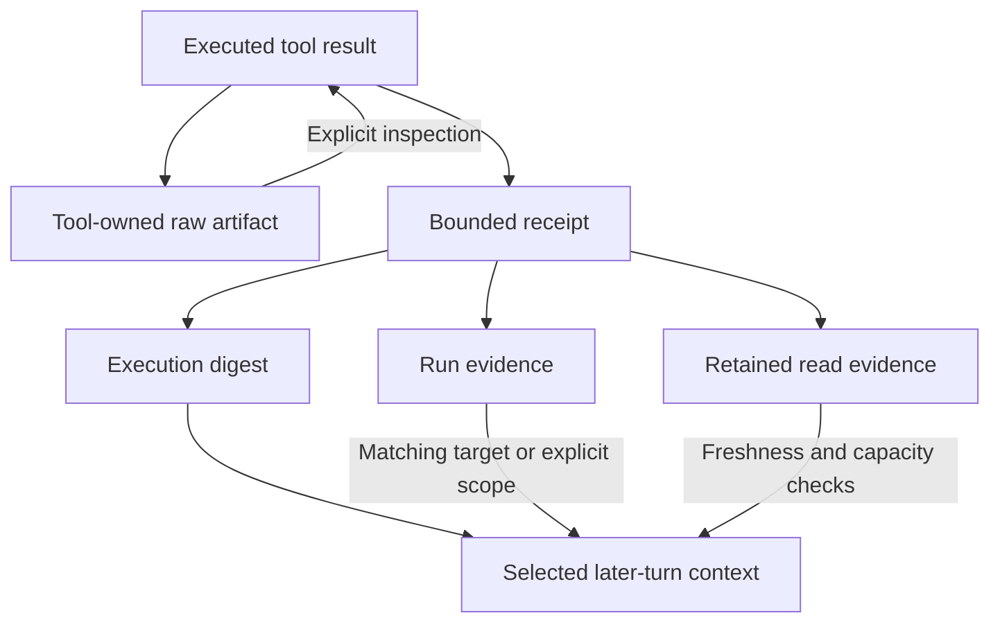

# Runtime and context construction

A normal chat turn is coordinated by `runAskChat`. Its contract requires a root, a message, and composed PostgreSQL application stores. Transport adapters supply trusted agent context separately from serialized request arguments.

## Turn lifecycle

```mermaid
sequenceDiagram
    participant Client
    participant Controller
    participant Runtime
    participant Store as PostgreSQL continuity
    participant Context
    participant Loop as Model/tool loop
    Client->>Controller: Message, session, attachments
    Controller->>Runtime: Normalized turn and trusted agent context
    Runtime->>Runtime: Serialize this session's turns
    Runtime->>Store: Claim run generation
    Store-->>Runtime: Ownership and recovery context
    Runtime->>Context: Prepare history and support
    Context-->>Runtime: Prepared context
    Runtime->>Store: Persist originating user turn
    Runtime->>Context: Assemble and inspect final prompt
    Runtime->>Store: Check ownership before execution
    Runtime->>Loop: Provider-ready input and tool schemas
    Loop-->>Runtime: Answer, evidence, artifacts
    Runtime->>Store: Check ownership after execution
    Runtime->>Store: Transactional terminal commit
    Store-->>Runtime: Current or superseded
    Runtime-->>Client: Chat-shaped result
```

The source order includes support preparation before early user-turn persistence, then final prompt assembly and execution. Recording the originating instruction before model/tool work makes interrupted work attributable. Peer delivery already persisted its attributed ingress and is not duplicated as an operator message. [Source: ingress and execution](https://github.com/NightShaman/Burrow/blob/d6490825401405ce719e007fd96a487c5b0cde56/backend/src/app-runtime.mjs#L356-L429)

## Session ownership and stale results

A per-session in-process queue prevents simultaneous operator turns and nested replies from invalidating each other within one process. PostgreSQL continuity heads and transactional ownership checks protect cross-process completion.

The runtime checks ownership before starting model work and again afterward. Terminal finalization runs through a continuity commit. If ownership changed, the result is `superseded`, the stale answer is not published as current, and a compact recovery manifest records the need to reconcile durable state. This guards terminal persistence; it cannot undo a tool's already-completed external effect. [Source: session queue](https://github.com/NightShaman/Burrow/blob/d6490825401405ce719e007fd96a487c5b0cde56/backend/src/app-runtime.mjs#L42-L68) [Source: execution checks](https://github.com/NightShaman/Burrow/blob/d6490825401405ce719e007fd96a487c5b0cde56/backend/src/runtime-model-execution.mjs#L11-L55) [Source: terminal commit](https://github.com/NightShaman/Burrow/blob/d6490825401405ce719e007fd96a487c5b0cde56/backend/src/runtime-terminal-commit.mjs#L4-L39)

In release `2026.10.02.7`, `continuity_state` owns the head, interruption manifest, and recovery queue; `continuity_log` records changed snapshots. Indexed state columns support active/pending recovery selection. Session-list compatibility can still expose a joined head, but ordinary session metadata is no longer the storage authority for those records. See [Persistence recovery](persistence.md#runtime-continuity-and-crash-recovery) and [Storage schema](../reference/storage-schema.md#conversations-and-original-evidence). [Source: native continuity state](https://github.com/NightShaman/Burrow/blob/2d979fecca8434fe02a6ed2e8225c46eb4690098/backend/src/postgres-continuity-state-store.mjs#L5-L76)

## Context preparation is a first-class boundary

ContextBuilder consumes a versioned prepared envelope. Normal preparation reads canonical conversation state, considers compression, and verifies that selected history is covered rather than silently dropping uncovered turns. It can rebuild after compression before assembling the final provider request.

Important failure categories include uncovered history, unavailable compression, and an assembled prompt that remains over budget. Exact behavior of exceptional branches and the estimate's limits are tracked in [Known limitations](../project/known-limitations.md). [Source: preparation](https://github.com/NightShaman/Burrow/blob/d6490825401405ce719e007fd96a487c5b0cde56/backend/src/context-preparation.mjs#L17-L153) [Source: builder contract and guard](https://github.com/NightShaman/Burrow/blob/d6490825401405ce719e007fd96a487c5b0cde56/backend/src/context-builder.mjs#L7-L35)

### Provider-ready order

The provider-facing message projection separates:

1. Identity/profile system material
2. Stable operating instructions
3. Support context, with provenance
4. Prior conversation summary
5. Recent role-preserving dialogue
6. The current user instruction

This is different from the flattened diagnostic prompt and from the broad section names in the runtime contract. Prior summaries are support for continuity, not replacement source evidence. Attributed peer messages preserve their origin instead of masquerading as user instructions. [Source: role-structured assembly](https://github.com/NightShaman/Burrow/blob/d6490825401405ce719e007fd96a487c5b0cde56/backend/src/prompt-assembler.mjs#L242-L298)

### Budgets and current-message integrity

The current message is atomic. Context handling may reduce older dialogue and lower-priority support, but does not silently cut the current instruction to an arbitrary character limit. Profiles, skills, attachments, summaries, and evidence projections have their own bounds.

The final request is inspected against configured model capacity. The estimate is not an exact tokenizer and does not account equally for every transport field. Treat it as a pressure signal; see [Models](../concepts/models.md#context-capacity-and-the-meter). [Source: assembly bounds](https://github.com/NightShaman/Burrow/blob/d6490825401405ce719e007fd96a487c5b0cde56/backend/src/prompt-assembler.mjs#L481-L625)

## How evidence returns to later turns



These mechanisms solve different problems:

- **Execution digest:** a bounded account of important tool outcomes for continuity
- **Run evidence:** compact objective/outcome/target records selected by exact target or explicit continuity scope
- **Read evidence:** retained excerpts with source range and freshness metadata
- **Raw artifacts:** detailed output available for explicit inspection

Run evidence is bounded to 32 records and 14 days in its helper. Read evidence is bounded to 12 items/64 KiB and checks size/mtime before reuse; it does not revalidate a content hash. Neither mechanism grants action authority. [Source: run-evidence lifecycle](https://github.com/NightShaman/Burrow/blob/d6490825401405ce719e007fd96a487c5b0cde56/backend/src/run-evidence.mjs#L188-L278) [Source: retained reads](https://github.com/NightShaman/Burrow/blob/d6490825401405ce719e007fd96a487c5b0cde56/backend/src/read-evidence.mjs#L54-L86)

For the complete continuity model, read [Memory](../concepts/memory.md) and [Conversation history](../concepts/conversation-history.md).

## Planning and compatibility

An optional configured planner can return structured intent/support information. Without that planner, fallback labels derive from explicit transport controls. Normal chat still uses a model-owned tool loop; planner metadata is not an automatic worker spawn or authorization decision.

Explicit work-item continuation takes a retained compatibility branch. The public `runBurrow` entrypoint is also a declared compatibility adapter around proposal, verification, and commit logic. Do not assume its gates are the normal-chat execution path. [Source: planner fallback](https://github.com/NightShaman/Burrow/blob/d6490825401405ce719e007fd96a487c5b0cde56/backend/src/turn-planner.mjs#L519-L581) [Source: compatibility contract](https://github.com/NightShaman/Burrow/blob/d6490825401405ce719e007fd96a487c5b0cde56/backend/src/runner.mjs#L122-L128)

## Restart recovery

Graceful interruption writes compact runtime-owned manifests, then aborts active runs. Recovery considers a bounded same-session transcript and requires a reliable objective. It chooses `resume`, `reconcile_first`, or `needs_user_input`. Pending recovery continuations are durably claimed before work begins.

Recovery is therefore reconciliation, not blind replay. It must inspect already-completed effects and pending verification before repeating actions. [Source: interruption](https://github.com/NightShaman/Burrow/blob/d6490825401405ce719e007fd96a487c5b0cde56/backend/src/interrupted-run-recovery.mjs#L8-L38) [Source: resume policy](https://github.com/NightShaman/Burrow/blob/d6490825401405ce719e007fd96a487c5b0cde56/backend/src/recovery-resume-policy.mjs#L24-L52) [Source: durable recovery claims](https://github.com/NightShaman/Burrow/blob/d6490825401405ce719e007fd96a487c5b0cde56/backend/src/recovery-continuation-runner.mjs#L3-L35)
