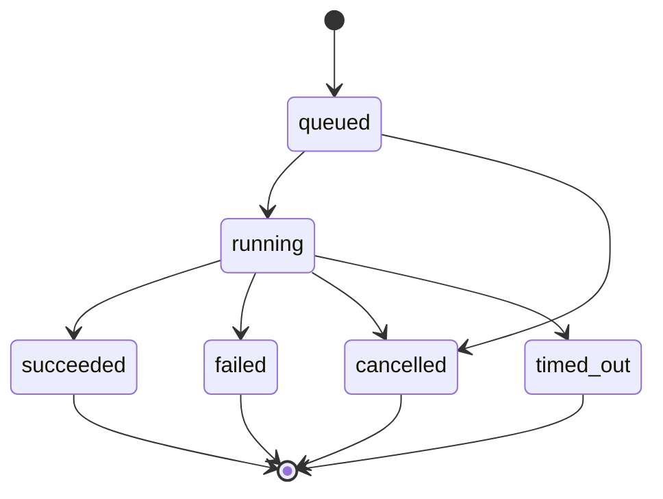

# Agents and minions

Use a registered agent for a persistent identity and configuration. Use a minion for an explicit child task. Use peer messaging when one registered agent needs another agent's response in that recipient's own context.

## Registered agents

An agent record supplies an ID, display name, enabled state, available capabilities, context configuration, and optional execution-environment assignment. IDs are validated; a display name is not a replacement for durable identity.

Agent workspace/data roots are derived from the runtime workspace root and agent ID. The runtime creates `skills`, `sessions`, `artifacts`, and `tools` directories below that root. Directory existence does not mean those directories own conversation persistence: current conversation authority is PostgreSQL. [Source: agent record and roots](https://github.com/NightShaman/Burrow/blob/d6490825401405ce719e007fd96a487c5b0cde56/backend/src/agent-registry.mjs#L41-L94)

### Profile and model context

Profile documents provide identity, rules, orientation, tool/environment facts, preferences, and configured continuity. They are loaded for the selected agent. A missing profile must not silently substitute another agent's profile. Models are selected from configured connections; a child can request a different enabled model without changing its parent's selection.

See [Initial setup](../getting-started/initial-setup.md), [Models](models.md), and [Persistence](../architecture/persistence.md). [Source: profile loading](https://github.com/NightShaman/Burrow/blob/d6490825401405ce719e007fd96a487c5b0cde56/backend/src/context-engine.mjs#L64-L105)

### Execution environment

An agent can use local execution or a registered remote provider/target assignment. The assignment chooses where supported process/filesystem operations run. Controller-owned conversation and configuration state remain separate from that execution host.

Legacy provider-less `gateway` assignments are normalized to unresolved data rather than guessed into a provider. Repair an unresolved assignment through the supported settings flow. This documentation does not cover provider-specific remote mods. [Source: assignment validation](https://github.com/NightShaman/Burrow/blob/d6490825401405ce719e007fd96a487c5b0cde56/backend/src/agent-registry.mjs#L12-L38)

## Minions: explicit child work

The native `spawn_subagent` tool requires:

- `task`: the full instruction
- `target.kind`: `filesystem`
- `target.root`: an absolute path to an existing directory

Optional fields include a short `label` and an exact configured `model` ID. The model inherits the parent selection when omitted. Tool-schema examples below illustrate agent tool arguments, not shell commands or HTTP request bodies.

```json
{
  "task": "Inspect the parser and its tests. Report concrete edge cases with file references; do not modify files.",
  "label": "Review parser",
  "target": {
    "kind": "filesystem",
    "root": "/srv/projects/example"
  }
}
```

The target is validated before dispatch. Local wrapper directories may be refined to a nested `repo` directory when only that directory has repository signals. The receipt records the resolved target; use it when interpreting results. [Source: tool schema](https://github.com/NightShaman/Burrow/blob/d6490825401405ce719e007fd96a487c5b0cde56/backend/src/action-proposal.mjs#L408-L434) [Source: validation and refinement](https://github.com/NightShaman/Burrow/blob/d6490825401405ce719e007fd96a487c5b0cde56/backend/src/subagent-tool-executor.mjs#L137-L224)

### What a minion receives

A child starts with a purpose-built prompt containing its task and working directory. It runs its own model/tool loop and does not receive the full parent conversation as a cloned transcript. Its standard tool surface includes filesystem, shell, Git, and nested child tools; it excludes the server-owned Forge dispatcher.

Local minions use a separate Node process. A remote-assigned minion uses the child runner in-process so it can preserve the trusted remote execution controller. Both have separate child-session lineage and receipts. [Source: child prompt and tools](https://github.com/NightShaman/Burrow/blob/d6490825401405ce719e007fd96a487c5b0cde56/backend/src/subagent-worker-runner.mjs#L44-L99) [Source: dispatch](https://github.com/NightShaman/Burrow/blob/d6490825401405ce719e007fd96a487c5b0cde56/backend/src/subagent-tool-executor.mjs#L279-L329)

!!! warning "Isolation is about session/process context"
    A minion target is not a filesystem cage. An instruction such as “do not modify files” communicates task scope, but the target directory does not remove mutation tools. Review [Permissions](../security/permissions.md), and see [Known limitations](../project/known-limitations.md) for current child-policy propagation caveats.

### Completion and evidence



These are the contract's allowed statuses; they do not imply that every dispatcher implements a timeout policy. The current local process runner does not install a timeout timer. [Source: status contract](https://github.com/NightShaman/Burrow/blob/d6490825401405ce719e007fd96a487c5b0cde56/backend/src/subagent-contracts.mjs#L6-L38) [Source: process lifecycle](https://github.com/NightShaman/Burrow/blob/d6490825401405ce719e007fd96a487c5b0cde56/backend/src/subagent-process-runner.mjs#L74-L145)

The child must call `finish_subagent` with `status` and `summary`. Optional structured verification distinguishes `passed`, `failed`, `failed_expected`, and `not_run`. Ordinary prose is not a terminal completion signal. If the child stops calling tools without finishing, the runtime asks once for a structured final report; failure to provide it becomes a failed result.

The parent receives bounded evidence, a summary, resolved target, lineage, and receipt references. Large raw outputs belong to trace artifacts. Do not infer “no changes occurred” merely from empty aggregate changed-file fields; inspect actual tool outcomes when side effects matter. [Source: terminal contract](https://github.com/NightShaman/Burrow/blob/d6490825401405ce719e007fd96a487c5b0cde56/backend/src/subagent-worker-runner.mjs#L324-L410) [Source: final synthesis](https://github.com/NightShaman/Burrow/blob/d6490825401405ce719e007fd96a487c5b0cde56/backend/src/subagent-worker-runner.mjs#L585-L628)

Identical structural spawn requests within the same parent lineage can reuse an existing record. This is mechanical deduplication, not semantic task matching. The identity includes `modelProfile` but not the exact requested model ID, so changing only that ID does not guarantee a separate child. Inspect `reused` and the resolved-model receipt. [Source: request identity](https://github.com/NightShaman/Burrow/blob/d6490825401405ce719e007fd96a487c5b0cde56/backend/src/subagent-tool-executor.mjs#L79-L125)

## Peer agent messages

`agent_send_message` addresses another registered agent, optionally choosing its recipient session. Messages are stored as attributed `agent` turns in both conversations; they are not impersonated operator messages.

| Mode | Behavior |
|---|---|
| `deliver` | Persist an attributed FYI without executing a recipient reply |
| `request_reply` | Execute one recipient response and mirror the response back; the sender may deliberately message again |
| `request_reply_complete` | Execute one recipient response, mirror it back, and remove peer messaging from the sender's continuation tool surface |

The default mode is `request_reply`; the recipient session defaults to `default`. Self-send is rejected. Concurrent reply requests to the same recipient session are serialized, and wait-graph cycles are rejected before new transcript ingress. [Source: message tool](https://github.com/NightShaman/Burrow/blob/d6490825401405ce719e007fd96a487c5b0cde56/backend/src/agent-chat-tool.mjs#L8-L41) [Source: delivery/reply flow](https://github.com/NightShaman/Burrow/blob/d6490825401405ce719e007fd96a487c5b0cde56/backend/src/agent-chat-tool.mjs#L84-L169)

```json
{
  "recipientAgentId": "reviewer",
  "targetSessionId": "design-review",
  "messageMode": "request_reply_complete",
  "content": "Review the proposed interface and return your conclusion with any blockers."
}
```

## Group conversations

A group room is a shared operator transcript over separate registered-agent runs. Each selected participant executes in its own agent-scoped `group-<channelId>` session, retaining that agent's identity, tools, memory scope, and continuity owner. A room does not combine participant grants or replace their individual contexts.

Explicit request recipients take precedence over recognized participant `@` mentions. With neither, the server broadcasts to every room participant. Unknown mentions reject the message; addressing uses participant IDs or names, with case-insensitive matching. The server launches selected participants asynchronously from the same captured room history, then appends attributed replies. Acceptance lists the launched runs; inspect each participant's outcome rather than treating it as a collective success. Each active participant run can be cancelled separately. [Source: group routing and dispatch](https://github.com/NightShaman/Burrow/blob/2d979fecca8434fe02a6ed2e8225c46eb4690098/backend/scripts/burrow-ui.mjs#L2992-L3040) [Source: mention matching](https://github.com/NightShaman/Burrow/blob/d6490825401405ce719e007fd96a487c5b0cde56/backend/src/group-channel-routing.mjs#L5-L50)

Use [Interface groups](interface.md#attachments-and-groups) for room controls and the [API reference](../reference/api.md) for request and cancellation endpoints.

## Watching and stopping work

Active peer runs expose bounded progress. Stopping an A2A parent cancels its active nested reply tree. Local minion process cancellation sends `SIGTERM` and cleans its temporary payload. Completed child visibility is a UI projection: the helper retains recent completed children for one hour and caps the displayed list; durable receipts are separate from that visible list.

See [Interface](interface.md), [Observability](../operations/observability.md), and [Execution flow](../architecture/execution-flow.md). [Source: active-run cancellation](https://github.com/NightShaman/Burrow/blob/d6490825401405ce719e007fd96a487c5b0cde56/backend/src/active-chat-runs.mjs#L70-L93) [Source: child visibility](https://github.com/NightShaman/Burrow/blob/d6490825401405ce719e007fd96a487c5b0cde56/backend/src/subagent-visibility.mjs#L1-L25)
