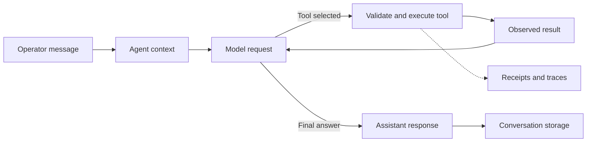

# Core concepts

BURROW is a chat-first runtime. An operator talks to a configured agent; the agent can answer, inspect files, run tools, delegate a bounded task, or use an enabled integration. The normal result is an assistant response. Progress, traces, receipts, and task state explain how that result was produced.

This distinction matters when operating the system: a successful HTTP request, a completed tool, and a verified task are different outcomes.

## The objects you work with

| Concept | Meaning | Important distinction |
|---|---|---|
| **Agent** | A registered identity with profile documents, model selection, grants, and runtime roots | An agent is persistent configuration, not one model call |
| **Session** | An agent-scoped conversation stream | Two agents using `default` still have different conversation ownership |
| **Conversation generation** | The active conversation history within a session, with previous history available through archive/reset mechanisms | Starting a new conversation does not delete all historical evidence |
| **Run / turn** | One execution of a submitted instruction, identified by a run ID | A run can contain several model requests and tool rounds |
| **Tool call** | A structured request selected by the model and checked by the runtime | A requested call is not evidence it executed |
| **Minion** | An isolated child agent session created with an explicit task and target | A minion is different from messaging another registered agent |
| **Task-board task** | A durable project/work tracking record | Assignment alone does not start agent work |
| **Receipt** | A bounded record of an operation and its result | A receipt is not the full raw output or an independent guarantee of correctness |
| **Trace** | Diagnostic records and artifacts associated with a run | Traces can contain sensitive operational content |

The runtime contracts explicitly separate chat turns, canonical turn envelopes, execution results, and side channels. [Source: runtime contracts](https://github.com/NightShaman/Burrow/blob/d6490825401405ce719e007fd96a487c5b0cde56/backend/src/chat-runtime-contracts.mjs#L1-L41)

## Configuration, context, and evidence

Keep three questions separate:

1. **What is configured?** Agent records, model connections, profile documents, tool grants, and other application settings have persistent owners
2. **What can the model see now?** Context preparation selects conversation, profile instructions, skills, and relevant continuity for this request
3. **What actually happened?** Executed tool results and their provenance establish the outcome of a particular action

For example, a profile can say that a project uses a particular build command. Running that command produces current evidence about whether the build passed. An earlier assistant statement that it passed does not replace a fresh failing result.

The product-owned prompt kernel reinforces this distinction and leaves identity, behavior rules, environment knowledge, and procedures to their appropriate profile or skill sources. [Source: chat kernel](https://github.com/NightShaman/Burrow/blob/d6490825401405ce719e007fd96a487c5b0cde56/backend/src/plain-chat-kernel.mjs#L1-L14)

## A normal turn

Normal chat is model-owned: runtime planning and route labels provide context and observability, while the model selects tools from the supplied schemas. A planner label does not independently spawn a child or turn prose into filesystem authority. [Source: normal-chat routing](https://github.com/NightShaman/Burrow/blob/d6490825401405ce719e007fd96a487c5b0cde56/backend/src/app-runtime.mjs#L299-L351)

## Workspace means starting context

An agent's workspace is its default context and working directory. An explicit filesystem target or per-command `cwd` can select another existing directory.

!!! warning "Workspace roots are not sandboxes"
    Agent homes and minion targets do not themselves enforce filesystem isolation. Native tools may address absolute paths outside the default workspace. Execution availability also depends on configured hard blocks, tool grants, operating-system permissions, and the selected execution environment. Read [Permissions](../security/permissions.md) before granting access to a host.

This is explicit in the execution-context implementation, which describes roots as selected-context facts rather than access-control boundaries. [Source: execution context](https://github.com/NightShaman/Burrow/blob/d6490825401405ce719e007fd96a487c5b0cde56/backend/src/execution-context.mjs#L25-L47) [Source: agent roots](https://github.com/NightShaman/Burrow/blob/d6490825401405ce719e007fd96a487c5b0cde56/backend/src/agent-registry.mjs#L68-L94)

## Reading completion correctly

- **Answered** means the model produced an answer-shaped result; it is not a universal verification certificate
- **Incomplete** includes a model that used tools but emitted no final answer
- **Model failed** identifies provider/model failure
- **Superseded** means a newer run owns the session, so the older run must not publish itself as current
- A tool receipt can be successful even when later verification fails

Normal chat and the retained legacy work-loop have different completion and verification behavior. See [Execution flow](../architecture/execution-flow.md) and [Known limitations](../project/known-limitations.md). [Source: terminal integrity](https://github.com/NightShaman/Burrow/blob/d6490825401405ce719e007fd96a487c5b0cde56/backend/src/runtime-plain-chat-finalizer.mjs#L138-L155)

## Where to go next

- [Agents and minions](agents-minions.md): identities, delegation, and peer messages
- [Workers, tasks, and schedules](workers-tasks.md): choose the right kind of work record
- [Tools](tools.md): native execution and evidence
- [Models](models.md): providers, capabilities, and context estimates
- [Conversation history](conversation-history.md) and [Memory](memory.md): continuity and storage
- [Architecture overview](../architecture/overview.md): component and ownership map
