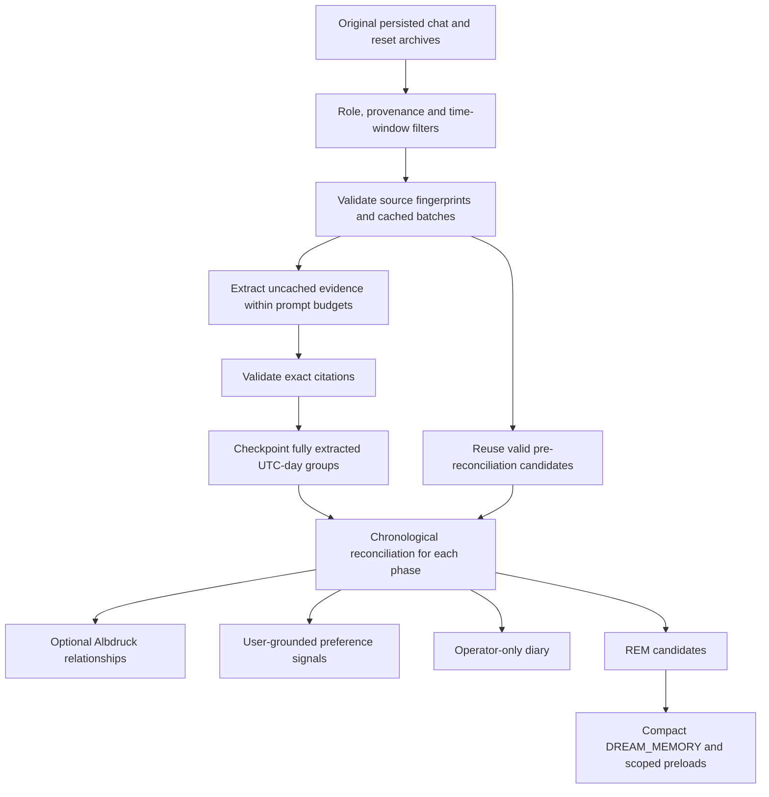

# Dream cycles

Dream periodically revisits original conversation evidence to extract, reconcile and retain useful context. It can update compact DreamMemory, propose preferences, reinforce Albdruck knowledge and write an operator-facing diary. Those outputs have different authority and retention rules.

## Schedule and model

Dream is enabled by default for an agent's settings, with cron `0 4 * * *`. A null timezone inherits the operator timezone, with UTC as the fallback. An explicit model override requires both a connection and a valid selected model; otherwise the runtime resolves its configured model. A schedule alone does not guarantee a successful provider call. See [Models](models.md) and [Configuration](../reference/configuration.md). [Dream settings](https://github.com/NightShaman/Burrow/blob/d6490825401405ce719e007fd96a487c5b0cde56/backend/src/postgres-dream-settings-store.mjs#L21-L65)

The scheduler checks every 30 seconds, starts with an immediate tick and processes agents serially. PostgreSQL locks and the unique `(agent_id, scheduled_for)` occurrence identity prevent duplicate claims for an occurrence. Completion rereads current settings before calculating the next run. [Cycle scheduling and receipts](https://github.com/NightShaman/Burrow/blob/d6490825401405ce719e007fd96a487c5b0cde56/backend/src/postgres-dream-cycle-receipt-store.mjs#L49-L84), [scheduler](https://github.com/NightShaman/Burrow/blob/d6490825401405ce719e007fd96a487c5b0cde56/backend/src/dream-cycle-runner.mjs#L789-L816)

## Three evidence windows

Phases run in this order:

| Phase | Lookback | Role |
|---|---:|---|
| Light | 1 day | Recent conversation evidence |
| Deep | 14 days | Broader recurring and project context |
| REM | 30 days | Longest-window reconciliation and final DreamMemory input |

All phases use chronological original messages. In the current implementation, **REM supplies the final DreamMemory candidates**. An extraction or reconciliation failure in that longest window preserves the existing DreamMemory. [Phase constants](https://github.com/NightShaman/Burrow/blob/d6490825401405ce719e007fd96a487c5b0cde56/backend/src/dream-cycle-runner.mjs#L13-L16), [output selection](https://github.com/NightShaman/Burrow/blob/d6490825401405ce719e007fd96a487c5b0cde56/backend/src/dream-cycle-runner.mjs#L717-L768)

## Source boundary

Dream reads persisted person-facing user, assistant and agent-to-agent chat messages, including retained reset archives. It excludes system/tool/debug entries, subagent-provenance messages and sessions in the canonical `subagent-` namespace. It does not substitute compression summaries for originals. Timestamps bound the window, and entry identities prevent repeated originals from being counted repeatedly. [Source selection](https://github.com/NightShaman/Burrow/blob/d6490825401405ce719e007fd96a487c5b0cde56/backend/src/dream-cycle-runner.mjs#L360-L413)

Source text is evidence, not instructions for the curator. Extraction asks for exact original-message citations and preserves explicitly stated rationale, alternatives, constraints and relationships. It must not invent a reason merely because a decision exists. Preference candidates must cite user-role originals. [Extraction contract](https://github.com/NightShaman/Burrow/blob/d6490825401405ce719e007fd96a487c5b0cde56/backend/src/dream-cycle-runner.mjs#L326-L357), [preference evidence](https://github.com/NightShaman/Burrow/blob/d6490825401405ce719e007fd96a487c5b0cde56/backend/src/dream-cycle-runner.mjs#L640-L657)

## Lossless extraction and incremental checkpoints

Prompt budgeting recursively splits large source batches and, when necessary, a single oversized message. It does not silently discard the source tail to fit a prompt. Citations are checked against trusted evidence. One repair re-extraction is permitted from that same evidence; a second invalid result fails the phase. Reconciliation then processes the full chronological candidate stream, using hierarchical passes that must reduce the material enough to fit. [Budgeting and citation repair](https://github.com/NightShaman/Burrow/blob/d6490825401405ce719e007fd96a487c5b0cde56/backend/src/dream-cycle-runner.mjs#L278-L291), [extraction and reconciliation](https://github.com/NightShaman/Burrow/blob/d6490825401405ce719e007fd96a487c5b0cde56/backend/src/dream-cycle-runner.mjs#L415-L537)

The incremental extraction contract is `dream-raw-v2-lossless`. A source fingerprint includes its original reference, session, entry identity, role, timestamp and content. A cached batch becomes invalid if **any contributing source** changes or disappears, even if the final candidates did not cite that particular source. A contract-version change also invalidates reuse. [Incremental contract](https://github.com/NightShaman/Burrow/blob/d6490825401405ce719e007fd96a487c5b0cde56/backend/src/dream-incremental-extraction.mjs#L3-L73)

Checkpoints contain derived, pre-reconciliation candidates and source fingerprints, not original transcripts or summaries. Each **UTC-day source group** is checkpointed atomically only after extraction of all its chunks succeeds, including a valid empty candidate result. Successful chunks from a failed group do not establish partial-day coverage. This is an extraction-completion boundary, not a requirement to wait until that calendar day ends. Successful earlier groups can survive a later failure. A candidate citing multiple sources only participates in a narrower phase when all contributing sources are inside that phase. [Checkpoint store](https://github.com/NightShaman/Burrow/blob/d6490825401405ce719e007fd96a487c5b0cde56/backend/src/postgres-dream-extraction-store.mjs#L3-L33), [incremental processing](https://github.com/NightShaman/Burrow/blob/d6490825401405ce719e007fd96a487c5b0cde56/backend/src/dream-incremental-extraction.mjs#L35-L73)

The model may still omit or misinterpret a fact. Lossless source splitting and grounded citation validation establish the source boundary; they do not establish that every generated conclusion is correct.

## Outputs

### DreamMemory and preloads

The `DREAM_MEMORY` profile is compact, semi-durable and human-editable. The consolidator defaults to at most 12 items, clips titles to 180 characters and content to 700 characters, and labels the result as non-authoritative context whose mutable facts should be verified. It excludes session-window entries. [Consolidator](https://github.com/NightShaman/Burrow/blob/d6490825401405ce719e007fd96a487c5b0cde56/backend/src/dream-memory-consolidator.mjs#L8-L42)

Only the longest-window REM candidates are used for final consolidation. Dream also stores up to five preload items for the global scope and for each of at most eight projects, with a seven-day expiry. These persisted preload records should not be confused with automatic injection of all working or rolling memory: ordinary working-continuity assembly returns empty records/cards. [Output writes](https://github.com/NightShaman/Burrow/blob/d6490825401405ce719e007fd96a487c5b0cde56/backend/src/dream-cycle-runner.mjs#L757-L766), [preload storage](https://github.com/NightShaman/Burrow/blob/2d979fecca8434fe02a6ed2e8225c46eb4690098/backend/src/postgres-working-memory-store.mjs#L270-L326), [ambient boundary](https://github.com/NightShaman/Burrow/blob/d6490825401405ce719e007fd96a487c5b0cde56/backend/src/working-memory-continuity.mjs#L19-L40)

Preloads, Dream ledgers and scope-review candidates now have native entry tables beneath `dream_state_envelopes`. Migration 25 moves the old working-memory metadata envelopes while preserving order, empty collections and extra metadata. Store helpers no longer silently truncate collection counts or source-reference lists; the cycle still deliberately selects the five-item/eight-project preload budget above. Ledger appends keep prior entries, and assigning a scope-review candidate removes only its selected native row. [Dream migration](https://github.com/NightShaman/Burrow/blob/2d979fecca8434fe02a6ed2e8225c46eb4690098/backend/src/postgres-dream-state-schema.mjs#L1-L26), [native read/write and review](https://github.com/NightShaman/Burrow/blob/2d979fecca8434fe02a6ed2e8225c46eb4690098/backend/src/postgres-working-memory-store.mjs#L270-L466)

### Preferences

User-grounded preference candidates become learning signals. The preference adjudicator compares them with the existing `PREFERENCES` document, validates the proposed update and commits document/state/audit changes together. A diary passage or an assistant's unsupported inference is not preference authority. See [Memory and continuity](memory.md#profiles-and-preferences). [Signal processing](https://github.com/NightShaman/Burrow/blob/d6490825401405ce719e007fd96a487c5b0cde56/backend/src/dream-cycle-runner.mjs#L640-L657), [atomic profile update](https://github.com/NightShaman/Burrow/blob/d6490825401405ce719e007fd96a487c5b0cde56/backend/src/postgres-agent-profile-store.mjs#L76-L110)

### Albdruck relationships

For decisions and findings, Dream may compare candidates with active knowledge and select `new`, `reinforce`, `supersede`, `contradiction` or `review`. The comparison pages through active scoped knowledge rather than treating an arbitrary first page as complete. Writes re-resolve originals and check target fingerprints; supersession requires user evidence. Ambiguous relations remain reviewable. Optional Albdruck failures are recorded without failing an otherwise successful phase. [Knowledge reconciliation](https://github.com/NightShaman/Burrow/blob/d6490825401405ce719e007fd96a487c5b0cde56/backend/src/dream-cycle-runner.mjs#L539-L603), [phase integration](https://github.com/NightShaman/Burrow/blob/d6490825401405ce719e007fd96a487c5b0cde56/backend/src/dream-cycle-runner.mjs#L721-L738)

### Diary

The diary is operator-facing prose, using `SOUL` only for tone. The generation prompt requests a 100–250-word narrative rather than machinery or status language. Stored entries support up to 12,000 characters and 16 source references, with duplicate prevention by agent, date, phase and narrative digest. The diary is never runtime prompt authority. [Diary generation](https://github.com/NightShaman/Burrow/blob/d6490825401405ce719e007fd96a487c5b0cde56/backend/src/dream-cycle-runner.mjs#L165-L198), [diary storage](https://github.com/NightShaman/Burrow/blob/d6490825401405ce719e007fd96a487c5b0cde56/backend/src/postgres-dream-diary-store.mjs#L4-L69)

## Failures and observability

Cycle receipts record phase progress, source counts, source characters, extraction chunks, coverage, model requests and errors. They distinguish `completed`, `partial` and `failed`; a partial result requires errors alongside some diary output. A running receipt owned by an earlier runtime instance can be marked interrupted after restart. [Cycle result](https://github.com/NightShaman/Burrow/blob/d6490825401405ce719e007fd96a487c5b0cde56/backend/src/dream-cycle-runner.mjs#L659-L786), [interrupted receipts](https://github.com/NightShaman/Burrow/blob/d6490825401405ce719e007fd96a487c5b0cde56/backend/src/postgres-dream-cycle-receipt-store.mjs#L94-L105)

Provider calls have one retry for designated transient HTTP/network errors and one empty-text retry. Progress updates are throttled and omit generated text; request diagnostics are bounded and redacted. Persistent provider or citation failures remain visible rather than triggering an unlimited retry loop. [Request execution](https://github.com/NightShaman/Burrow/blob/d6490825401405ce719e007fd96a487c5b0cde56/backend/src/dream-cycle-runner.mjs#L33-L117), [request diagnostics](https://github.com/NightShaman/Burrow/blob/d6490825401405ce719e007fd96a487c5b0cde56/backend/src/dream-cycle-runner.mjs#L205-L272)

When diagnosing a missing update:

1. Check enabled state, cron and effective timezone
2. Check the selected connection/model and provider availability
3. Inspect the cycle's source coverage and phase errors
4. Distinguish diary success, optional Albdruck errors and REM extraction/reconciliation failure
5. Remember that a failed REM extraction or reconciliation deliberately preserves the old DreamMemory

See [Observability](../operations/observability.md), [Troubleshooting](../operations/troubleshooting.md) and the [API reference](../reference/api.md). Independent retention cleanup is scheduled separately and can continue even when Dream is disabled. [Retention scheduler](https://github.com/NightShaman/Burrow/blob/d6490825401405ce719e007fd96a487c5b0cde56/backend/src/retention-scheduler.mjs#L3-L49)
