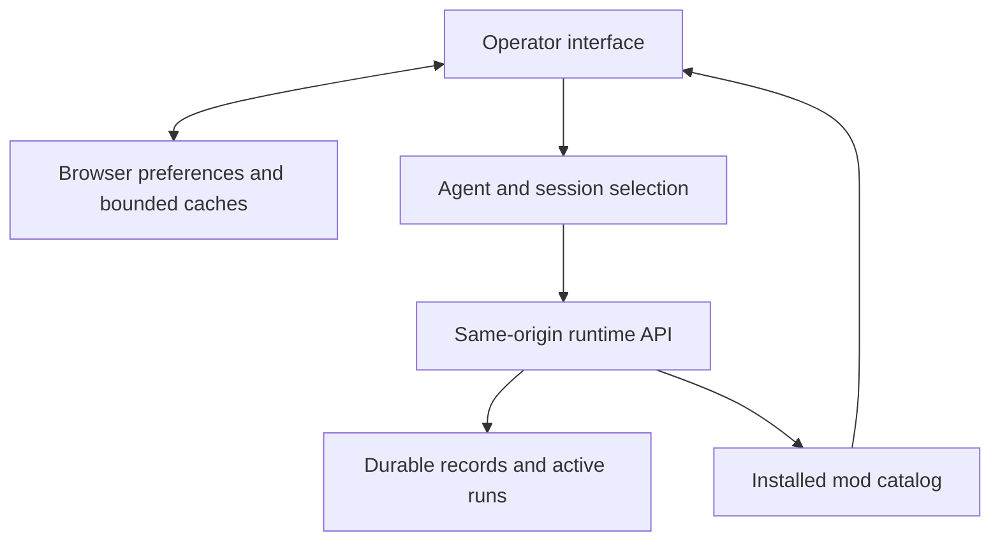

# Interface guide

The BURROW interface brings conversations, agent configuration, project tasks, retained evidence, and media generation into one operator console. This guide describes release **2026.10.10.4**. Start by checking the agent and session: these determine which conversation and records you are viewing.

The runtime owns durable state. The browser presents API responses and live activity, and keeps some local preferences and conversation caches. A visible answer, an accepted job, and a verified result are different states; inspect the relevant run or evidence before treating work as complete.

## Find the right page

| Page | Use it for |
| --- | --- |
| **Chat** | Agent conversations, named sessions, Minion activity, group rooms, and workspace file tabs |
| **Tasks** | Projects, named project paths, task status, assignment, and task execution |
| **Archive** | Retained Chat, Dreams, Tiddle continuity, and run Proof |
| **Brains** | Explicit agent-owned saved memories, search, editing, and deletion |
| **Forge** | Generation catalogs, jobs, artifacts, and recent creations |
| **Settings** | General preferences, agents, skills, connections, and mods |

Enabled mods can add control pages beside the built-in navigation, settings sections, and Archive readers. These contributions depend on the installed mod catalog. Page changes use in-app state; the built-in pages do not have separate URL routes. [Source: application navigation](https://github.com/NightShaman/Burrow/blob/c15064dd177788afcdda357a5e545510f754a754/ui/src/App.tsx)

### Sign in and complete setup

The interface discovers the authentication mode through `/api/auth/discovery` on startup and opens its sign-in form when Basic authentication is required. Basic credentials entered here are held in browser memory. See [Authentication](../security/authentication.md) for server modes, proxy requirements, and exposure precautions. [Source: startup authentication](https://github.com/NightShaman/Burrow/blob/c15064dd177788afcdda357a5e545510f754a754/ui/src/main.tsx)

A fresh or incomplete response from `GET /api/setup/status` opens **Settings → Agents** and the five-step setup wizard:

1. Import an existing export, or start fresh.
2. Set the operator profile.
3. Name the first agent and optionally choose an avatar.
4. Write its initial `SOUL.md` personality.
5. Choose a model connection, or finish and configure one later.

Successful completion marks setup complete and returns to Chat. An intentionally empty, already configured agent registry does not itself force the wizard. Follow [Initial setup](../getting-started/initial-setup.md) for the full procedure and import precautions. [Sources: setup routing](https://github.com/NightShaman/Burrow/blob/c15064dd177788afcdda357a5e545510f754a754/ui/src/App.tsx), [wizard](https://github.com/NightShaman/Burrow/blob/c15064dd177788afcdda357a5e545510f754a754/ui/src/features/settings/AgentToolbar.tsx)

## Runtime and resource ownership

The built-in console uses the local runtime serving the page. There is no built-in remote target selector. Node Goblin integrations, when installed, use explicit mod-owned APIs; a mod page is not a global runtime switch. Confirm any mod-specific destination before using its controls.

The built-in `api` and `apiLocal` helpers both request same-origin paths. Agent selection changes the conversation owner; it does not change the server. Mod installation remains a trust decision. See [Trust boundaries](../security/trust-boundaries.md). Sources: [local-runtime application](https://github.com/NightShaman/Burrow/blob/c15064dd177788afcdda357a5e545510f754a754/ui/src/App.tsx), [transport](https://github.com/NightShaman/Burrow/blob/c15064dd177788afcdda357a5e545510f754a754/ui/src/app/api.ts).

The registry distinguishes loading, empty, and unavailable states. A failed refresh can leave the last known agents visible with an **Agents stale** status. Treat that label as a failed refresh, not confirmation of current availability. [Source: registry status](https://github.com/NightShaman/Burrow/blob/c15064dd177788afcdda357a5e545510f754a754/ui/src/app/AppChrome.tsx)

## Chat and sessions

1. Select an agent in the **Agents** panel.
2. Select a session, or choose **New session** and supply its name.
3. Check **Provider**, **Model**, **Effort**, and **Temp**. Model controls are locked while the displayed run is active.
4. Enter a message. **Enter** sends; **Shift+Enter** inserts a line break.
5. Follow the live activity, then read the persisted answer and any verification evidence.

Model selection is saved through `PUT /api/agents/{agentId}/model-selection`. Available models and effort choices come from configured connections; `off` is also offered for effort. See [Models and providers](models.md) for connection setup and resolution behavior. [Sources: toolbar](https://github.com/NightShaman/Burrow/blob/c15064dd177788afcdda357a5e545510f754a754/ui/src/features/chat/ChatPage.tsx), [selection write](https://github.com/NightShaman/Burrow/blob/c15064dd177788afcdda357a5e545510f754a754/ui/src/App.tsx)

### Session controls and project context

**New session** creates a named conversation. Names are 1–80 characters, begin with a letter or number, and otherwise use letters, numbers, underscores, or hyphens. The regular session picker excludes child, group, artifact, and task-owned sessions. **Reset Session** resets the selected session while retaining that session ID and clearing the displayed conversation; it is different from creating another named session. [Sources: named sessions](https://github.com/NightShaman/Burrow/blob/c15064dd177788afcdda357a5e545510f754a754/ui/src/features/chat/useChatComposers.ts), [reset behavior](https://github.com/NightShaman/Burrow/blob/c15064dd177788afcdda357a5e545510f754a754/ui/src/features/chat/useChatSession.ts)

The composer suggests `/help`, `/context [full]`, `/status`, `/new`, and `/stop`; the runtime interprets these commands. Type `$project` to choose a project for the current conversation, or `$project clear` to remove that binding. Project context uses `/api/task-board/conversation-project`; it does not itself execute a task. [Source: composer commands](https://github.com/NightShaman/Burrow/blob/c15064dd177788afcdda357a5e545510f754a754/ui/src/features/chat/ChatComposer.tsx), [project selection](https://github.com/NightShaman/Burrow/blob/c15064dd177788afcdda357a5e545510f754a754/ui/src/features/chat/ChatComposer.tsx)

### Activity, stopping, and reconnecting

Chat submits `POST /api/chat` and requests newline-delimited JSON events. Progress, tool activity, and streamed answer text are displayed separately. The terminal result supplies the authoritative final answer; materially different streamed text can remain in a separate disclosure. A connection error does not prove that the runtime stopped. [Sources: stream decoder](https://github.com/NightShaman/Burrow/blob/c15064dd177788afcdda357a5e545510f754a754/ui/src/features/chat/chatStream.ts), [run handling](https://github.com/NightShaman/Burrow/blob/c15064dd177788afcdda357a5e545510f754a754/ui/src/features/chat/useChatRun.ts)

**Stop response** (square icon) aborts the browser's stream read and requests cancellation through `POST /api/chat/{runId}/cancel`. The interface also reconciles activity with `GET /api/chat/runs/active` and reloads session records. It does not resume a disconnected stream from an event offset. If work seems stuck, inspect current runtime activity and [Troubleshooting](../operations/troubleshooting.md) before resubmitting a potentially consequential instruction. [Source: active-run reconciliation](https://github.com/NightShaman/Burrow/blob/c15064dd177788afcdda357a5e545510f754a754/ui/src/features/chat/useChatSession.ts), [cancellation request](https://github.com/NightShaman/Burrow/blob/c15064dd177788afcdda357a5e545510f754a754/ui/src/features/chat/useChatRun.ts)

Expand an agent to inspect its Minion streams. Selecting a Minion changes the displayed child conversation while preserving its parent agent's identity for workspace ownership. See [Agents and Minions](agents-minions.md). MCP activity cards show provider and tool identity without exposing MCP argument and output payloads in the transcript. Use the relevant evidence views when investigating execution. [Source: transcript activity](https://github.com/NightShaman/Burrow/blob/c15064dd177788afcdda357a5e545510f754a754/ui/src/features/chat/ChatTranscript.tsx), [MCP activity filtering](https://github.com/NightShaman/Burrow/blob/c15064dd177788afcdda357a5e545510f754a754/ui/src/features/chat/useChatRun.ts)

### Interpreting progress and sending a correction

The waiting label distinguishes **Waiting for runtime**, **Preparing response**, **Model request prepared**, **Model request dispatched**, and **Model response received; continuing**. A prepared request is not proof that the provider received it. Expand tool cards for individual pending, successful, or failed tool entries; a collapsed card's checkmark is not proof that every operation succeeded. **Progress recorded** retains available run progress after completion.

While a run is active, send a follow-up in the composer to steer it. Check the message status: **Pending — next model boundary**, **Delivered to run**, or **Not delivered — retained as follow-up**. Delivery does not mean the requested correction has already been carried out. If a run fails or is interrupted, inspect recorded activity and the final answer before repeating work. Sources: [stage labels](https://github.com/NightShaman/Burrow/blob/c15064dd177788afcdda357a5e545510f754a754/ui/src/features/chat/chatLiveStage.ts), [transcript and tool status](https://github.com/NightShaman/Burrow/blob/c15064dd177788afcdda357a5e545510f754a754/ui/src/features/chat/ChatTranscript.tsx), [live steering](https://github.com/NightShaman/Burrow/blob/c15064dd177788afcdda357a5e545510f754a754/ui/src/features/chat/ChatPage.tsx).

### Attachments and groups

Single-agent chat accepts supported image and text formats. Default browser budgets are **8 MiB per file**, **16 MiB per batch**, and **8 files**; deployments can override these budgets. Check the attachment list and any validation error before sending. PDF extraction is not supported; convert the relevant content to a supported text format before attaching. Persisted attachments and generated artifacts have separate download routes under `/api/attachments/` and `/api/generated-artifacts/`; images can be enlarged. Sources: [attachment handling](https://github.com/NightShaman/Burrow/blob/c15064dd177788afcdda357a5e545510f754a754/ui/src/App.tsx), [browser budgets](https://github.com/NightShaman/Burrow/blob/c15064dd177788afcdda357a5e545510f754a754/ui/src/app/clientBudgets.ts), [file chooser](https://github.com/NightShaman/Burrow/blob/c15064dd177788afcdda357a5e545510f754a754/ui/src/features/chat/ChatComposer.tsx).

Choose **Group Chat** to create or reopen a room. A new room needs a name and at least two agents from the local registry. Participant-scoped `@` suggestions help address messages; the runtime parses the submitted text. Each participant's active run can be cancelled separately. Rooms use `/api/group-channels`; browser tabs can be restored, while room content is fetched from the server. Unsupported or oversized group attachments are skipped, so verify the attachment list. [Sources: room creation](https://github.com/NightShaman/Burrow/blob/c15064dd177788afcdda357a5e545510f754a754/ui/src/features/chat/useChatComposers.ts), [group messages and cancellation](https://github.com/NightShaman/Burrow/blob/c15064dd177788afcdda357a5e545510f754a754/ui/src/features/groups/GroupChannelsPage.tsx)

## Workspace and layout

The **Workspace** panel shows the selected parent agent's files, including while a Minion conversation is displayed. Open a file to create a document tab, choose **Edit**, then **Save**. The tab retains its owning agent for the save request. The editor provides text editing, not a terminal or a file creation, rename, deletion, or upload workflow. [Sources: workspace ownership and requests](https://github.com/NightShaman/Burrow/blob/c15064dd177788afcdda357a5e545510f754a754/ui/src/features/workspace/useWorkspaceFiles.ts), [editor controls](https://github.com/NightShaman/Burrow/blob/c15064dd177788afcdda357a5e545510f754a754/ui/src/features/chat/ChatPage.tsx)

The file tree uses `GET /api/workspace/files?agentId=…&scope=agent`; reads and saves use `/api/workspace/file`. Automatic tree refresh runs while Workspace is visible in the left rail and keeps the last tree on a transient failure. The backend remains responsible for file access checks. [Source: refresh visibility](https://github.com/NightShaman/Burrow/blob/c15064dd177788afcdda357a5e545510f754a754/ui/src/App.tsx)

Use **Settings → General → Rail panels** to choose **None**, **Agents**, **Workspace**, **Codex-LB**, **Accounts**, or **System** for each rail. A rail can show a single panel or divided panels. Defaults put Agents above Workspace on the left and no panels on the right. **Appearance** offers Smatchet Dark, Nexus, Hatchet, Chaos, Paper, Terminal, and High Contrast. These layout preferences are stored in the browser. [Sources: panel registry](https://github.com/NightShaman/Burrow/blob/c15064dd177788afcdda357a5e545510f754a754/ui/src/app/panelRegistry.ts), [themes and defaults](https://github.com/NightShaman/Burrow/blob/c15064dd177788afcdda357a5e545510f754a754/ui/src/app/usePersistedLayout.ts)

On viewports at or below 600 pixels wide, controls reflow into a stacked layout, rails remain available, and page tabs can scroll horizontally. Scroll the page or expand a collapsed rail to reach its controls. [Source: responsive rules](https://github.com/NightShaman/Burrow/blob/c15064dd177788afcdda357a5e545510f754a754/ui/src/styles/responsive.css)

## Settings map

Settings separates category navigation, subsection navigation, the main editor, and supporting inventory or details. The agent selected inside Settings can differ from the agent selected in Chat; check the agent selector before saving.

| Category | Built-in sections |
| --- | --- |
| **General** | Operator profile, Operator timezone, Execution boundaries, Trace retention, Brain memory, Export, Rail panels, Tiddle Signal, Appearance |
| **Agents** | Agent details, Profile documents, MCP tools, Cron jobs, Dreams, Skills |
| **Skills** | Shared text-skill catalog, lifecycle, global use, and assignments |
| **Connections** | Authentication, Model providers, MCP servers, API tokens |
| **Mods** | Installed mods, Mod sources, Automatic source checks |

[Source: settings navigation and editors](https://github.com/NightShaman/Burrow/blob/c15064dd177788afcdda357a5e545510f754a754/ui/src/features/settings/SettingsPage.tsx)

- **Model providers:** configure connections, discover or enter models, and select the models exposed to agents. See [Models and providers](models.md).
- **MCP servers and MCP tools:** configure a connection under Connections, then review the selected agent's grants under Agents. Mod-managed connections and mod-authorized tools have different editing rules. See [MCP](mcp.md).
- **Profile documents:** edit `SOUL.md`, `RULES.md`, `ORIENTATION.md`, `PREFERENCES.md`, `TOOLS.md`, and `DreamMemory.md`. See [Agents and Minions](agents-minions.md).
- **Cron jobs and Dreams:** manage their separate schedules and model selections. An accepted manual job trigger is not a completed run. See [Workers and tasks](workers-tasks.md) and [Dreams](dreams.md).
- **Tiddle Signal:** configure continuity curation separately from task execution. See [Memory](memory.md).
- **Authentication, API tokens, and Execution boundaries:** review the relevant [authentication](../security/authentication.md) and [trust-boundary](../security/trust-boundaries.md) guidance before changing access or execution policy.
- **Export and Trace retention:** use [Backup and recovery](../operations/backup-recovery.md) and [Operator procedures](../operations/procedures.md). Trace retention requires **Save policy**, then **Preview cleanup**, then **Run now** for the unchanged policy. Any edit requires saving and previewing again.

[Sources: profile kinds](https://github.com/NightShaman/Burrow/blob/c15064dd177788afcdda357a5e545510f754a754/ui/src/features/settings/AgentProfileDocuments.tsx), [retention actions](https://github.com/NightShaman/Burrow/blob/c15064dd177788afcdda357a5e545510f754a754/ui/src/features/settings/RetentionSettings.tsx)

Under **Mods**, source checks discover available versions; they do not automatically install updates. Newly installed mods begin disabled, while updates preserve enabled state. Honor any restart-required or busy response shown by the runtime. A mod UI is dynamically imported into the application page, so installing a mod is a trust decision rather than an isolated visual customization. [Sources: mod lifecycle](https://github.com/NightShaman/Burrow/blob/c15064dd177788afcdda357a5e545510f754a754/ui/src/features/settings/ModsSettings.tsx), [mod settings host](https://github.com/NightShaman/Burrow/blob/c15064dd177788afcdda357a5e545510f754a754/ui/src/features/settings/ModSettingsHost.tsx)

## Tasks and retained evidence

### Tasks

Create a project before creating a task. Projects hold description, notes, and named paths; those path references do not grant filesystem access. The visible board columns are **Backlog**, **To Do**, **In Progress**, **Review**, and **Done**. New UI tasks default to To Do with Normal priority. Edit a task to change its status or assignment; the current board does not implement drag-and-drop status transitions. [Source: board columns](https://github.com/NightShaman/Burrow/blob/c15064dd177788afcdda357a5e545510f754a754/ui/src/features/tasks/TasksPage.tsx)

To run a task:

1. Create or open a task, select its project and **Assignee**, then save it.
2. Reopen its details if necessary and choose **Execute**. Unsaved changes must be saved first; unassigned, Done, and cancelled tasks cannot execute.
3. Follow **Live execution** in the editor. The UI polls the active run and refreshes the saved task when that run ends.
4. Inspect the assigned agent's **default** conversation and **Archive → Proof** for the final answer, blockers, and verification evidence.

Dispatch awaits the stored task and project; the previous unawaited-lookup limitation no longer applies. A successful dispatch records a running execution with a run ID, then records its terminal result asynchronously. Execution receipt status is separate from the board column: dispatch and completion do not automatically move the card to In Progress or Done. Check the result and update task status deliberately. If progress remains visible after a connection failure, check the active run before clicking Execute again. Deleting a project also deletes its tasks. See [Workers and tasks](workers-tasks.md). Sources: [task controls and polling](https://github.com/NightShaman/Burrow/blob/c15064dd177788afcdda357a5e545510f754a754/ui/src/features/tasks/TasksPage.tsx), [dispatch and completion](https://github.com/NightShaman/Burrow/blob/c15064dd177788afcdda357a5e545510f754a754/backend/scripts/burrow-ui.mjs), [execution receipts](https://github.com/NightShaman/Burrow/blob/c15064dd177788afcdda357a5e545510f754a754/backend/src/postgres-task-board-store.mjs).

### Archive

Use **Chat** for retained sessions, **Dreams** for recorded Dream entries, **Tiddle** for continuity cards and history, and **Proof** for run evidence. The calendar uses the browser's timezone. Chat and Dream lists support server-side date filtering; Tiddle and Proof do not use that same date filter.

Chat opens recent messages first and can load earlier pages. **Copy loaded chat** copies only the messages already loaded. A history-unavailable response is different from reaching the beginning of retained history. In Proof, expand the evidence to distinguish execution from verification: an answer without a terminal receipt is shown as **unverified**, and a linked child's execution state is separate from its verification result. The control labeled **Full redacted tool evidence** loads retained traces when expanded. That label is not a blanket guarantee that every free-text value is secret-free; review evidence before sharing it. [Sources: Chat reader](https://github.com/NightShaman/Burrow/blob/c15064dd177788afcdda357a5e545510f754a754/ui/src/features/tasks/ArchiveReaders.tsx), [Archive requests](https://github.com/NightShaman/Burrow/blob/c15064dd177788afcdda357a5e545510f754a754/ui/src/features/tasks/archiveRepository.ts), [Proof presentation](https://github.com/NightShaman/Burrow/blob/c15064dd177788afcdda357a5e545510f754a754/ui/src/features/tasks/ArchiveRunsProof.tsx), [evidence details](https://github.com/NightShaman/Burrow/blob/c15064dd177788afcdda357a5e545510f754a754/ui/src/features/tasks/ArchiveRunsProof.tsx)

### Brains

Brains replaces the former Albdruck knowledge workspace. Memories belong to an **Agent owner**; there is no global memory owner or Knowledge/Recall tab pair.

1. Open **Brains** and select **Agent owner**.
2. Use **Search memories** and **Search**, or choose **New memory**.
3. Supply a **Title**, **Content**, and optional **Source references (one per line)**, then **Create memory**.
4. Open an existing entry, make changes, and choose **Save memory**. Check the returned revision and owner.
5. If a conflict appears, preserve any unsaved wording you need, choose **Reload memory**, review the current version, then reapply the intended edit.

Migrated records show **Migrated from legacy Albdruck** and expandable **Legacy migration details**. These are retained historical records, not fresh verification. Saved memories are not automatically preloaded into every conversation. The agent explicitly invokes memory tools when needed. For provider-backed semantic search, see **Settings → General → Brain memory** and [Memory](memory.md). Embeddings are optional and off by default; hosted providers can receive memory contents and queries when enabled.

!!! warning "Review before deleting memories"
    **Delete memory** and **Delete selected memories** issue deletion immediately; the workspace does not present the old conversation-purge confirmation. **Select page** selects only the displayed page. Bulk deletion is independent per record, not atomic: inspect every reported result, then **Reload list** before retrying conflicts. Deleting a saved memory does not erase its source conversation.

Sources: [Brains controls and revision checks](https://github.com/NightShaman/Burrow/blob/c15064dd177788afcdda357a5e545510f754a754/ui/src/features/albdruck/AlbdruckPage.tsx), [embedding controls and disclosure](https://github.com/NightShaman/Burrow/blob/c15064dd177788afcdda357a5e545510f754a754/ui/src/features/settings/BrainEmbeddingSettings.tsx).

### Recall original conversations

1. Open **Archive → Chat**, choose the agent, and narrow the search or calendar date.
2. Open a matching session and use **Load earlier messages** to retrieve older messages. **Copy loaded chat** includes only the loaded portion.
3. For a previous decision or an exact quotation, ask that agent to search its historical conversations with `session_search`, including reset history, and expand the original source with surrounding dialogue.
4. Check the source session, date, and reset/archive provenance before relying on the result. A memory summary or an empty search is not proof that an original exists or never existed.

Brains search searches saved memories, not conversation transcripts. The old Albdruck Recall, retention, and purge workflows are no longer available in the built-in UI; their compatibility route adapter is not mounted by the server. Do not use an old purge recipe for this release. See [Operator procedures](../operations/procedures.md) for supported maintenance. Sources: [Archive readers](https://github.com/NightShaman/Burrow/blob/c15064dd177788afcdda357a5e545510f754a754/ui/src/features/tasks/ArchiveReaders.tsx), [historical search tool](https://github.com/NightShaman/Burrow/blob/c15064dd177788afcdda357a5e545510f754a754/backend/src/action-proposal.mjs), [retired compatibility adapter](https://github.com/NightShaman/Burrow/blob/c15064dd177788afcdda357a5e545510f754a754/backend/src/legacy-albdruck-routes.mjs).

## Forge

Forge provides **Image**, **Video**, **Speech**, **Music**, and **Recents** views. Available generation models come from `GET /api/forge/catalog`; a visible mode may have no supported or configured model. In particular, the interface explicitly represents unavailable video and source-attachment capabilities.

Choose an available model, enter the prompt or speech script, and start generation. Music has separate musical-direction and optional lyrics inputs; lyrics are guidance rather than a guarantee of verbatim output. `POST /api/forge/jobs` accepts the job, and the UI polls queued or running jobs. Inspect the resulting artifact or failure details. **Attach to conversation** uses the current agent and session, so verify that destination first. [Sources: catalog and saved selections](https://github.com/NightShaman/Burrow/blob/c15064dd177788afcdda357a5e545510f754a754/ui/src/features/forge/ForgePage.tsx), [job, attachment, and mode controls](https://github.com/NightShaman/Burrow/blob/c15064dd177788afcdda357a5e545510f754a754/ui/src/features/forge/ForgePage.tsx)

## Browser data and privacy

The interface uses `localStorage` for more than appearance. Closing the tab or refreshing the page does not clear all conversation content from the browser.

| Stored browser data | Current bound or behavior |
| --- | --- |
| Chat drafts | Up to 50 nonempty drafts; a 24-hour age rule is applied when reading or writing the cache |
| Chat transcripts | Up to 24 cached conversations; optimistic image-preview data URLs are removed before storage |
| Session lists | Cached lists for up to 16 agents |
| Archive Chat lists | Up to 12 scoped query entries by default |
| Group tabs | Room-tab descriptors survive reloads; file tabs do not |
| UI preferences | Agent selection, themes, rail layout, and ordering persist |

[Sources: drafts](https://github.com/NightShaman/Burrow/blob/c15064dd177788afcdda357a5e545510f754a754/ui/src/features/chat/chatDraftCache.ts), [transcript cache](https://github.com/NightShaman/Burrow/blob/c15064dd177788afcdda357a5e545510f754a754/ui/src/features/chat/chatConversationCache.ts), [session cache](https://github.com/NightShaman/Burrow/blob/c15064dd177788afcdda357a5e545510f754a754/ui/src/features/chat/chatSessionRepository.ts), [tab persistence](https://github.com/NightShaman/Burrow/blob/c15064dd177788afcdda357a5e545510f754a754/ui/src/app/useAppTabs.ts)

Archive cache keys include target identity, agent, query, date, timezone, and content kind. Cached rows can appear before refresh; check stale or unavailable warnings rather than treating a cached list as a successful current read. Default transcript cache limits also bound turns per conversation, text size per turn, and aggregate serialized content. Sources: [Archive scope keys](https://github.com/NightShaman/Burrow/blob/c15064dd177788afcdda357a5e545510f754a754/ui/src/features/tasks/archiveCache.ts), [cache budgets](https://github.com/NightShaman/Burrow/blob/c15064dd177788afcdda357a5e545510f754a754/ui/src/app/clientBudgets.ts).

These bounds are cache policies, not secure-erasure guarantees. Protect the browser profile, especially on shared machines, and include site data in any browser cleanup procedure. Clearing browser site data does not delete server records; server retention or purge does not promise to erase every browser copy. Basic credentials are held separately in memory and are not written to these caches. [Sources: storage helpers](https://github.com/NightShaman/Burrow/blob/c15064dd177788afcdda357a5e545510f754a754/ui/src/app/browserStorage.ts), [Basic credential storage](https://github.com/NightShaman/Burrow/blob/c15064dd177788afcdda357a5e545510f754a754/ui/src/app/auth.ts)

For endpoint schemas and error behavior, use the [API reference](../reference/api.md). For deployment checks, failure diagnosis, and consequential maintenance actions, use [Troubleshooting](../operations/troubleshooting.md) and [Operator procedures](../operations/procedures.md).
