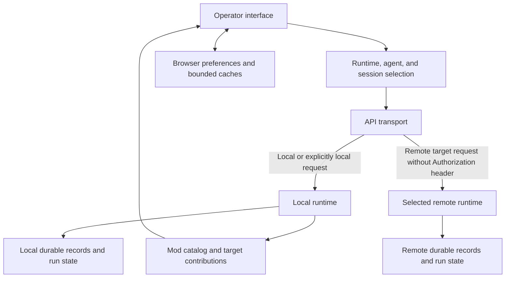

# Interface guide

The BURROW interface brings conversations, agent configuration, project tasks, retained evidence, and media generation into one operator console. Start by checking the selected runtime, agent, and session. Those three choices determine where a conversation runs and which records you are viewing.

The runtime owns durable state. The browser presents API responses and live activity, and keeps some local preferences and conversation caches. A visible answer, an accepted job, and a verified result are different states; inspect the relevant run or evidence before treating work as complete.

## Find the right page

| Page | Use it for |
| --- | --- |
| **Chat** | Agent conversations, named sessions, Minion activity, group rooms, and workspace file tabs |
| **Tasks** | Projects, named project paths, task status, assignment, and task execution |
| **Archive** | Retained Chat, Dreams, Tiddle continuity, and run Proof |
| **Albdruck** | Derived knowledge, original-conversation recall, review, retention, and conversation purge |
| **Forge** | Generation catalogs, jobs, artifacts, and recent creations |
| **Settings** | General preferences, agents, skills, connections, and mods |

Enabled mods can add control pages beside the built-in navigation, settings sections, and Archive readers. These contributions depend on the installed mod catalog. Page changes use in-app state; the built-in pages do not have separate URL routes. [Source: application navigation](https://github.com/NightShaman/Burrow/blob/d6490825401405ce719e007fd96a487c5b0cde56/ui/src/App.tsx#L196-L218)

### Sign in and complete setup

The interface probes `/api/health` on startup and opens its sign-in form when Basic authentication is required. Basic credentials entered here are held in browser memory. See [Authentication](../security/authentication.md) for server modes, proxy requirements, and exposure precautions. [Source: startup authentication](https://github.com/NightShaman/Burrow/blob/d6490825401405ce719e007fd96a487c5b0cde56/ui/src/main.tsx#L15-L53)

A fresh or incomplete response from `GET /api/setup/status` opens **Settings → Agents** and the five-step setup wizard:

1. Import an existing export, or start fresh.
2. Set the operator profile.
3. Name the first agent and optionally choose an avatar.
4. Write its initial `SOUL.md` personality.
5. Choose a model connection, or finish and configure one later.

Successful completion marks setup complete and returns to Chat. An intentionally empty, already configured agent registry does not itself force the wizard. Follow [Initial setup](../getting-started/initial-setup.md) for the full procedure and import precautions. [Sources: setup routing](https://github.com/NightShaman/Burrow/blob/d6490825401405ce719e007fd96a487c5b0cde56/ui/src/App.tsx#L36-L49), [wizard](https://github.com/NightShaman/Burrow/blob/d6490825401405ce719e007fd96a487c5b0cde56/ui/src/features/settings/AgentToolbar.tsx#L163-L208)

## Runtime and resource ownership

**Local** is the runtime serving the interface. Mods may contribute additional HTTP or HTTPS API targets. The target selector appears only when more than one target is available. Switching targets clears the selected agent and child stream, then loads the new target's registry. [Sources: target catalog](https://github.com/NightShaman/Burrow/blob/d6490825401405ce719e007fd96a487c5b0cde56/ui/src/app/apiTargets.ts#L101-L148), [selection](https://github.com/NightShaman/Burrow/blob/d6490825401405ce719e007fd96a487c5b0cde56/ui/src/app/useRuntimeSelection.ts#L11-L46)

The frontend distinguishes an API target from the agent ID owned by that target. Remote resources use target-qualified identities internally; API calls use the runtime's own resource ID. That naming convention is not an authorization boundary. [Source: resource identity](https://github.com/NightShaman/Burrow/blob/d6490825401405ce719e007fd96a487c5b0cde56/ui/src/app/apiTargets.ts#L151-L168)

!!! warning "Remote credentials are not inherited"
    The current target contract has no remote credential configuration. The transport removes the `Authorization` header from requests to a target with a base URL, including a header supplied by a caller. Local Basic credentials are not forwarded. A listed target is therefore not a promise that an authenticated remote deployment is reachable. Check the target's supported connection arrangement and [Trust boundaries](../security/trust-boundaries.md) before using it.

Requests are not all governed by the visible selector. `api` follows the active target, `apiForTarget` names an owner explicitly, and `apiLocal` stays on the interface's origin. Mod catalog discovery and contributed Settings and Archive helpers are local; mod control-panel helpers and generic mod-management requests use the active-target transport. Check ownership before making changes in a multi-runtime installation. [Sources: transport](https://github.com/NightShaman/Burrow/blob/d6490825401405ce719e007fd96a487c5b0cde56/ui/src/app/api.ts#L340-L414), [control host](https://github.com/NightShaman/Burrow/blob/d6490825401405ce719e007fd96a487c5b0cde56/ui/src/features/mods/ModPanelHost.tsx#L5-L32), [Archive host](https://github.com/NightShaman/Burrow/blob/d6490825401405ce719e007fd96a487c5b0cde56/ui/src/features/mods/ModArchiveHost.tsx#L25-L40), [management transport](https://github.com/NightShaman/Burrow/blob/d6490825401405ce719e007fd96a487c5b0cde56/ui/src/features/settings/modManagementApi.ts#L44-L52)

The registry distinguishes loading, empty, and unavailable states. A failed refresh can leave the last known agents visible with an **Agents stale** status. Treat that label as a failed refresh, not confirmation of current availability. [Source: registry status](https://github.com/NightShaman/Burrow/blob/d6490825401405ce719e007fd96a487c5b0cde56/ui/src/app/AppChrome.tsx#L42-L52)

## Chat and sessions

1. Select an agent in the **Agents** panel.
2. Select a session, or choose **New session** and supply its name.
3. Check **Provider**, **Model**, **Effort**, and **Temp**. Model controls are locked while the displayed run is active.
4. Enter a message. **Enter** sends; **Shift+Enter** inserts a line break.
5. Follow the live activity, then read the persisted answer and any verification evidence.

Model selection is saved through `PUT /api/agents/{agentId}/model-selection`. Available models and effort choices come from configured connections; `off` is also offered for effort. See [Models and providers](models.md) for connection setup and resolution behavior. [Sources: toolbar](https://github.com/NightShaman/Burrow/blob/d6490825401405ce719e007fd96a487c5b0cde56/ui/src/features/chat/ChatPage.tsx#L13-L37), [selection write](https://github.com/NightShaman/Burrow/blob/d6490825401405ce719e007fd96a487c5b0cde56/ui/src/App.tsx#L125-L140)

### Session controls and project context

**New session** creates a named conversation. Names are 1–80 characters, begin with a letter or number, and otherwise use letters, numbers, underscores, or hyphens. The regular session picker excludes child, group, artifact, and task-owned sessions. **Reset Session** resets the selected session and returns the browser's selection to `default`; it is different from creating another named session. [Sources: named sessions](https://github.com/NightShaman/Burrow/blob/d6490825401405ce719e007fd96a487c5b0cde56/ui/src/features/chat/useChatComposers.ts#L85-L117), [reset behavior](https://github.com/NightShaman/Burrow/blob/d6490825401405ce719e007fd96a487c5b0cde56/ui/src/features/chat/useChatSession.ts#L404-L415)

The composer suggests `/help`, `/context [full]`, `/status`, `/new`, and `/stop`; the runtime interprets these commands. Type `$project` to choose a project for the current conversation, or `$project clear` to remove that binding. Project context uses `/api/task-board/conversation-project`; it does not itself execute a task. [Source: composer commands](https://github.com/NightShaman/Burrow/blob/d6490825401405ce719e007fd96a487c5b0cde56/ui/src/features/chat/ChatComposer.tsx#L9-L24), [project selection](https://github.com/NightShaman/Burrow/blob/d6490825401405ce719e007fd96a487c5b0cde56/ui/src/features/chat/ChatComposer.tsx#L107-L138)

### Activity, stopping, and reconnecting

Chat submits `POST /api/chat` and requests newline-delimited JSON events. Progress, tool activity, and streamed answer text are displayed separately. The terminal result supplies the authoritative final answer; materially different streamed text can remain in a separate disclosure. A connection error does not prove that the runtime stopped. [Sources: stream decoder](https://github.com/NightShaman/Burrow/blob/d6490825401405ce719e007fd96a487c5b0cde56/ui/src/features/chat/chatStream.ts#L16-L62), [run handling](https://github.com/NightShaman/Burrow/blob/d6490825401405ce719e007fd96a487c5b0cde56/ui/src/features/chat/useChatRun.ts#L62-L141)

**Stop** aborts the browser's stream read and requests cancellation through `POST /api/chat/{runId}/cancel`. The interface also reconciles activity with `GET /api/chat/runs/active` and reloads session records. It does not resume a disconnected stream from an event offset. If work seems stuck, inspect current runtime activity and [Troubleshooting](../operations/troubleshooting.md) before resubmitting a potentially consequential instruction. [Source: active-run reconciliation](https://github.com/NightShaman/Burrow/blob/d6490825401405ce719e007fd96a487c5b0cde56/ui/src/features/chat/useChatSession.ts#L293-L365), [cancellation request](https://github.com/NightShaman/Burrow/blob/d6490825401405ce719e007fd96a487c5b0cde56/ui/src/features/chat/useChatRun.ts#L153-L159)

Expand an agent to inspect its Minion streams. Selecting a Minion changes the displayed child conversation while preserving its parent agent's identity for workspace ownership. See [Agents and Minions](agents-minions.md). MCP activity cards show provider and tool identity without exposing MCP argument and output payloads in the transcript. Use the relevant evidence views when investigating execution. [Source: transcript activity](https://github.com/NightShaman/Burrow/blob/d6490825401405ce719e007fd96a487c5b0cde56/ui/src/features/chat/ChatTranscript.tsx#L37-L85), [MCP activity filtering](https://github.com/NightShaman/Burrow/blob/d6490825401405ce719e007fd96a487c5b0cde56/ui/src/features/chat/useChatRun.ts#L91-L110)

### Attachments and groups

Single-agent chat accepts supported image and text formats up to **22,000,000 bytes per file**. PDF validation is present, but the file chooser's advertised extensions omit PDF; group attachment validation does not include it. Check that every intended file appears before sending. Persisted attachments and generated artifacts have separate download routes under `/api/attachments/` and `/api/generated-artifacts/`. Supported images can be opened in an enlarged preview. [Sources: attachment validation](https://github.com/NightShaman/Burrow/blob/d6490825401405ce719e007fd96a487c5b0cde56/ui/src/App.tsx#L161-L168), [attachment rendering](https://github.com/NightShaman/Burrow/blob/d6490825401405ce719e007fd96a487c5b0cde56/ui/src/features/chat/ChatTranscript.tsx#L202-L300)

Choose **Group Chat** to create or reopen a room. A new room needs a name and at least two agents from the active target. Participant-scoped `@` suggestions help address messages; the runtime parses the submitted text. Each participant's active run can be cancelled separately. Rooms use `/api/group-channels`; browser tabs can be restored, while room content is fetched from the server. Unsupported or oversized group attachments are skipped, so verify the attachment list. [Sources: room creation](https://github.com/NightShaman/Burrow/blob/d6490825401405ce719e007fd96a487c5b0cde56/ui/src/features/chat/useChatComposers.ts#L129-L156), [group messages and cancellation](https://github.com/NightShaman/Burrow/blob/d6490825401405ce719e007fd96a487c5b0cde56/ui/src/features/groups/GroupChannelsPage.tsx#L83-L172)

## Workspace and layout

The **Workspace** panel shows the selected parent agent's files, including while a Minion conversation is displayed. Open a file to create a document tab, choose **Edit**, then **Save**. The tab retains its owning agent for the save request. The editor provides text editing, not a terminal or a file creation, rename, deletion, or upload workflow. [Sources: workspace ownership and requests](https://github.com/NightShaman/Burrow/blob/d6490825401405ce719e007fd96a487c5b0cde56/ui/src/features/workspace/useWorkspaceFiles.ts#L17-L67), [editor controls](https://github.com/NightShaman/Burrow/blob/d6490825401405ce719e007fd96a487c5b0cde56/ui/src/features/chat/ChatPage.tsx#L93-L110)

The file tree uses `GET /api/workspace/files?agentId=…&scope=agent`; reads and saves use `/api/workspace/file`. Automatic tree refresh runs while Workspace is visible in the left rail and keeps the last tree on a transient failure. The backend remains responsible for file access checks. [Source: refresh visibility](https://github.com/NightShaman/Burrow/blob/d6490825401405ce719e007fd96a487c5b0cde56/ui/src/App.tsx#L65-L69)

Use **Settings → General → Rail panels** to choose **None**, **Agents**, **Workspace**, **Codex-LB**, **Accounts**, or **System** for each rail. A rail can show a single panel or divided panels. Defaults put Agents above Workspace on the left and no panels on the right. **Appearance** offers Smatchet Dark, Nexus, Hatchet, Chaos, Paper, Terminal, and High Contrast. These layout preferences are stored in the browser. [Sources: panel registry](https://github.com/NightShaman/Burrow/blob/d6490825401405ce719e007fd96a487c5b0cde56/ui/src/app/panelRegistry.ts#L5-L12), [themes and defaults](https://github.com/NightShaman/Burrow/blob/d6490825401405ce719e007fd96a487c5b0cde56/ui/src/app/usePersistedLayout.ts#L19-L70)

On viewports at or below 600 pixels wide, the responsive stylesheet hides both rails and the toolbar labels containing model selectors. Use a wider viewport for those controls. [Source: responsive rules](https://github.com/NightShaman/Burrow/blob/d6490825401405ce719e007fd96a487c5b0cde56/ui/src/styles/responsive.css#L1)

## Settings map

Settings separates category navigation, subsection navigation, the main editor, and supporting inventory or details. The agent selected inside Settings can differ from the agent selected in Chat; check the agent selector before saving.

| Category | Built-in sections |
| --- | --- |
| **General** | Operator profile, Operator timezone, Execution boundaries, Trace retention, Export, Rail panels, Tiddle Signal, Appearance |
| **Agents** | Agent details, Profile documents, MCP tools, Cron jobs, Dreams, Skills |
| **Skills** | Shared text-skill catalog, lifecycle, global use, and assignments |
| **Connections** | Authentication, Model providers, MCP servers, API tokens |
| **Mods** | Installed mods, Mod sources, Automatic source checks |

[Source: settings navigation and editors](https://github.com/NightShaman/Burrow/blob/d6490825401405ce719e007fd96a487c5b0cde56/ui/src/features/settings/SettingsPage.tsx#L37-L160)

- **Model providers:** configure connections, discover or enter models, and select the models exposed to agents. See [Models and providers](models.md).
- **MCP servers and MCP tools:** configure a connection under Connections, then review the selected agent's grants under Agents. Mod-managed connections and mod-authorized tools have different editing rules. See [MCP](mcp.md).
- **Profile documents:** edit `SOUL.md`, `RULES.md`, `ORIENTATION.md`, `PREFERENCES.md`, `TOOLS.md`, and `DreamMemory.md`. See [Agents and Minions](agents-minions.md).
- **Cron jobs and Dreams:** manage their separate schedules and model selections. An accepted manual job trigger is not a completed run. See [Workers and tasks](workers-tasks.md) and [Dreams](dreams.md).
- **Tiddle Signal:** configure continuity curation separately from task execution. See [Memory](memory.md).
- **Authentication, API tokens, and Execution boundaries:** review the relevant [authentication](../security/authentication.md) and [trust-boundary](../security/trust-boundaries.md) guidance before changing access or execution policy.
- **Export and Trace retention:** use [Backup and recovery](../operations/backup-recovery.md) and [Operator procedures](../operations/procedures.md). Trace-retention preview can use an unsaved form, while **Run now** uses the saved server policy. Save intended changes first.

[Sources: profile kinds](https://github.com/NightShaman/Burrow/blob/d6490825401405ce719e007fd96a487c5b0cde56/ui/src/features/settings/AgentProfileDocuments.tsx#L1-L35), [retention actions](https://github.com/NightShaman/Burrow/blob/d6490825401405ce719e007fd96a487c5b0cde56/ui/src/features/settings/RetentionSettings.tsx#L12-L33)

Under **Mods**, source checks discover available versions; they do not automatically install updates. Newly installed mods begin disabled, while updates preserve enabled state. Honor any restart-required or busy response shown by the runtime. A mod UI is dynamically imported into the application page, so installing a mod is a trust decision rather than an isolated visual customization. [Sources: mod lifecycle](https://github.com/NightShaman/Burrow/blob/d6490825401405ce719e007fd96a487c5b0cde56/ui/src/features/settings/ModsSettings.tsx#L208-L241), [mod settings host](https://github.com/NightShaman/Burrow/blob/d6490825401405ce719e007fd96a487c5b0cde56/ui/src/features/settings/ModSettingsHost.tsx#L116-L185)

## Tasks and retained evidence

### Tasks

Create a project before creating a task. Projects hold description, notes, and named paths; those path references do not grant filesystem access. The visible board columns are **Backlog**, **To Do**, **In Progress**, **Review**, and **Done**. New UI tasks default to To Do with Normal priority. Edit a task to change its status or assignment; the current board does not implement drag-and-drop status transitions. [Source: board columns](https://github.com/NightShaman/Burrow/blob/d6490825401405ce719e007fd96a487c5b0cde56/ui/src/features/tasks/TasksPage.tsx#L62-L68)

**Execute** requires an assigned agent and is intended to dispatch through `POST /api/task-board/tasks/{id}/execute`. The UI follows the returned execution and refreshes persisted task details afterward. The documented Backend has unawaited asynchronous task lookups in this dispatch path, so the normal task can be rejected as unassigned; do not treat the UI action as a verified successful launch. Inspect the result instead of assuming acceptance or a status label proves success. Deleting a project also deletes its tasks. See [Workers and tasks](workers-tasks.md). [Source: task board](https://github.com/NightShaman/Burrow/blob/d6490825401405ce719e007fd96a487c5b0cde56/ui/src/features/tasks/TasksPage.tsx#L134-L249)

### Archive

Use **Chat** for retained sessions, **Dreams** for recorded Dream entries, **Tiddle** for continuity cards and history, and **Proof** for run evidence. The calendar uses the browser's timezone. Chat and Dream lists support server-side date filtering; Tiddle and Proof do not use that same date filter.

Chat opens recent messages first and can load earlier pages. **Copy loaded chat** copies only the messages already loaded. A history-unavailable response is different from reaching the beginning of retained history. In Proof, expand the evidence to distinguish execution from verification: an answer without a terminal receipt is shown as **unverified**, and a linked child's execution state is separate from its verification result. The control labeled **Full redacted tool evidence** loads retained traces when expanded. That label is not a blanket guarantee that every free-text value is secret-free; review evidence before sharing it. [Sources: Chat reader](https://github.com/NightShaman/Burrow/blob/d6490825401405ce719e007fd96a487c5b0cde56/ui/src/features/tasks/ArchiveReaders.tsx#L104-L147), [Archive requests](https://github.com/NightShaman/Burrow/blob/d6490825401405ce719e007fd96a487c5b0cde56/ui/src/features/tasks/archiveRepository.ts#L11-L72), [Proof presentation](https://github.com/NightShaman/Burrow/blob/d6490825401405ce719e007fd96a487c5b0cde56/ui/src/features/tasks/ArchiveRunsProof.tsx#L20-L36), [evidence details](https://github.com/NightShaman/Burrow/blob/d6490825401405ce719e007fd96a487c5b0cde56/ui/src/features/tasks/ArchiveRunsProof.tsx#L87-L171)

### Albdruck

Choose the agent or global scope, then use **Knowledge** to inspect derived knowledge or **Recall** to search original conversations. A preserved excerpt is evidence about an original; it is not the original itself. Knowledge review offers correction, supersession, and soft archive, with a required reason. See [Memory](memory.md) for the underlying stores and lifecycle. [Source: Albdruck review](https://github.com/NightShaman/Burrow/blob/d6490825401405ce719e007fd96a487c5b0cde56/ui/src/features/albdruck/AlbdruckPage.tsx#L28-L89)

!!! danger "Conversation purge is irreversible"
    **Permanently purge conversation** is separate from archiving a knowledge item. It requires a reason and typing the exact session ID, and can remove the original conversation and associated evidence and derived records. Current-main, running, and finalizing sessions are protected. Filesystem attachments are outside this purge. Review the scope and returned counts; do not use purge as a routine way to hide a conversation.

Albdruck retention settings are separate from trace retention. Saving an age policy does not immediately prune records. See [Operator procedures](../operations/procedures.md) before retention or erasure work. [Sources: purge controls and warnings](https://github.com/NightShaman/Burrow/blob/d6490825401405ce719e007fd96a487c5b0cde56/ui/src/features/albdruck/ConversationPurge.tsx#L5-L33), [retention settings](https://github.com/NightShaman/Burrow/blob/d6490825401405ce719e007fd96a487c5b0cde56/ui/src/features/albdruck/AlbdruckPage.tsx#L89)

## Forge

Forge provides **Image**, **Video**, **Speech**, **Music**, and **Recents** views. Available generation models come from `GET /api/forge/catalog`; a visible mode may have no supported or configured model. In particular, the interface explicitly represents unavailable video and source-attachment capabilities.

Choose an available model, enter the prompt or speech script, and start generation. Music has separate musical-direction and optional lyrics inputs; lyrics are guidance rather than a guarantee of verbatim output. `POST /api/forge/jobs` accepts the job, and the UI polls queued or running jobs. Inspect the resulting artifact or failure details. **Attach to conversation** uses the current agent and session, so verify that destination first. [Sources: catalog and saved selections](https://github.com/NightShaman/Burrow/blob/d6490825401405ce719e007fd96a487c5b0cde56/ui/src/features/forge/ForgePage.tsx#L130-L185), [job, attachment, and mode controls](https://github.com/NightShaman/Burrow/blob/d6490825401405ce719e007fd96a487c5b0cde56/ui/src/features/forge/ForgePage.tsx#L187-L228)

## Browser data and privacy

The interface uses `localStorage` for more than appearance. Closing the tab or refreshing the page does not clear all conversation content from the browser.

| Stored browser data | Current bound or behavior |
| --- | --- |
| Chat drafts | Up to 50 nonempty drafts; a 24-hour age rule is applied when reading or writing the cache |
| Chat transcripts | Up to 24 cached conversations; optimistic image-preview data URLs are removed before storage |
| Session lists | Cached lists for up to 16 agents |
| Archive Chat lists | Cached results for up to 12 search-text keys |
| Group tabs | Room-tab descriptors survive reloads; file tabs do not |
| UI preferences | Target and agent selection, themes, rail layout, and ordering persist |

[Sources: drafts](https://github.com/NightShaman/Burrow/blob/d6490825401405ce719e007fd96a487c5b0cde56/ui/src/features/chat/chatDraftCache.ts#L6-L44), [transcript cache](https://github.com/NightShaman/Burrow/blob/d6490825401405ce719e007fd96a487c5b0cde56/ui/src/features/chat/chatConversationCache.ts#L8-L60), [session cache](https://github.com/NightShaman/Burrow/blob/d6490825401405ce719e007fd96a487c5b0cde56/ui/src/features/chat/chatSessionRepository.ts#L5-L45), [tab persistence](https://github.com/NightShaman/Burrow/blob/d6490825401405ce719e007fd96a487c5b0cde56/ui/src/app/useAppTabs.ts#L5-L40)

The Archive Chat list cache is keyed by search text, not runtime and agent identity. Cached rows can appear before a server refresh; confirm the owner and fresh results when switching scope. [Sources: Archive cache](https://github.com/NightShaman/Burrow/blob/d6490825401405ce719e007fd96a487c5b0cde56/ui/src/features/tasks/archiveCache.ts#L80-L91), [cache refresh](https://github.com/NightShaman/Burrow/blob/d6490825401405ce719e007fd96a487c5b0cde56/ui/src/features/tasks/ArchivePage.tsx#L111-L133)

These bounds are cache policies, not secure-erasure guarantees. Protect the browser profile, especially on shared machines, and include site data in any browser cleanup procedure. Clearing browser site data does not delete server records; server retention or purge does not promise to erase every browser copy. Basic credentials are held separately in memory and are not written to these caches. [Sources: storage helpers](https://github.com/NightShaman/Burrow/blob/d6490825401405ce719e007fd96a487c5b0cde56/ui/src/app/browserStorage.ts#L14-L52), [Basic credential storage](https://github.com/NightShaman/Burrow/blob/d6490825401405ce719e007fd96a487c5b0cde56/ui/src/app/auth.ts#L1-L14)

For endpoint schemas and error behavior, use the [API reference](../reference/api.md). For deployment checks, failure diagnosis, and consequential maintenance actions, use [Troubleshooting](../operations/troubleshooting.md) and [Operator procedures](../operations/procedures.md).
