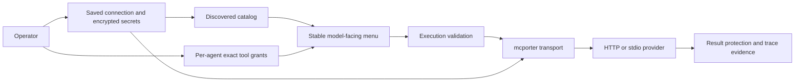

# MCP connections and tools

BURROW separates a provider connection, its discovered tool catalog and each agent's grants. Saving or discovering a connection does not grant an agent permission to call its tools. PostgreSQL owns these records; mcporter supplies transport.

## Connect, discover, grant

1. Open Settings → Connections → MCP servers and create an enabled connection.
2. Choose `http` with a base URL or `stdio` with a command and arguments. Supply only the credentials/environment the provider needs.
3. Discover the provider's tools. Use Diagnose when startup or connection checks fail.
4. Open the agent's MCP tool settings and grant specific tools from the catalog.
5. Make a test request through that agent and inspect the execution result. Discovery alone is not a successful invocation test.

HTTP credentials become a Bearer authorization header. A stdio provider runs as a subprocess with the service PATH and configured provider environment values. Use trusted executables and narrowly scoped provider credentials.

[Connection/grant routes](https://github.com/NightShaman/Burrow/blob/d6490825401405ce719e007fd96a487c5b0cde56/backend/scripts/ui/settings-routes.mjs#L49-L59) · [PostgreSQL authority](https://github.com/NightShaman/Burrow/blob/d6490825401405ce719e007fd96a487c5b0cde56/backend/src/postgres-mcp-settings-store.mjs#L5-L43) · [Adapter](https://github.com/NightShaman/Burrow/blob/d6490825401405ce719e007fd96a487c5b0cde56/backend/src/mcporter-adapter.mjs#L154-L179)

## The model-facing menu

Three stable native tools expose external capabilities:

| Tool | Purpose |
|---|---|
| `mcp_providers` | List enabled/discovered providers, at most 50 |
| `mcp_capabilities` | Search/page one provider's tools and see grant state |
| `mcp_call` | Invoke an exact provider/tool with arguments |

Provider lookup accepts an exact ID or a unique case-insensitive name. Capability pages default to 12 items and allow at most 20; descriptions are bounded to 2,000 characters. Ungranted tools can appear with `granted: false` so the agent can explain a missing capability. Visibility does not confer permission.

Execution rechecks the connection, exact tool and agent grant. Mod-provided tools additionally require the live mod registration. The runtime includes the menu when its resolved MCP connection map is nonempty. In this release the native `list_skills`/`load_skill` schema inclusion also shares that menu flag; a skill assignment alone does not guarantee those schemas are exposed in a connection-free turn.

[Menu](https://github.com/NightShaman/Burrow/blob/d6490825401405ce719e007fd96a487c5b0cde56/backend/src/mcp-menu.mjs#L14-L80) · [Native schemas](https://github.com/NightShaman/Burrow/blob/d6490825401405ce719e007fd96a487c5b0cde56/backend/src/action-proposal.mjs#L346-L348) · [Skill schema gate](https://github.com/NightShaman/Burrow/blob/d6490825401405ce719e007fd96a487c5b0cde56/backend/src/action-proposal.mjs#L444-L444) · [Execution checks](https://github.com/NightShaman/Burrow/blob/d6490825401405ce719e007fd96a487c5b0cde56/backend/src/proposal-executor.mjs#L291-L355)

## Connection lifecycle

| Lifecycle | Behavior | Secret-bearing local files |
|---|---|---|
| `ephemeral` | A transient mcporter configuration is created for an operation and removed afterward | Temporary configuration, mode `0600` |
| `keep_alive` | Stable configuration and an idempotently started mcporter daemon | `<mcporterRoot>/runtime/mcp-<id>.json`, mode `0600`, retained while active |

The adapter runtime directory is mode `0700`. Disable/delete or changes affecting provider launch stop the daemon and remove its configuration. Unchanged stable configuration is not rewritten. Encrypted database storage does not mean decrypted credentials never reach disk: the adapter needs a restricted configuration for transport.

Discovery and daemon operations normally have a 20-second deadline; calls have 30 seconds. Timeout sends TERM then KILL after one second. Each stdout/stderr capture retains at most a 256 KiB tail. A parsed provider `isError` response remains a tool error even if mcporter exits nonzero.

The server stores at most 200 sanitized keep-alive lifecycle events in PostgreSQL. At startup it imports an existing `mcp-provider-events.jsonl` once per source path, preserves the full original text in a separate import receipt, and leaves the source file in place. That raw legacy receipt can contain unknown or malformed content and is not guaranteed redacted. Standalone adapter use without the injected store retains the JSONL fallback. Restored state is labeled `lastKnown`; it is not proof that a provider process is currently alive.

[Configuration lifecycle](https://github.com/NightShaman/Burrow/blob/d6490825401405ce719e007fd96a487c5b0cde56/backend/src/mcporter-adapter.mjs#L182-L307) · [PostgreSQL lifecycle receipts](https://github.com/NightShaman/Burrow/blob/2d979fecca8434fe02a6ed2e8225c46eb4690098/backend/src/postgres-mcp-provider-state-store.mjs#L6-L61) · [Server store injection](https://github.com/NightShaman/Burrow/blob/2d979fecca8434fe02a6ed2e8225c46eb4690098/backend/scripts/burrow-ui.mjs#L156-L166)

## Updating secrets and grants

Secret values are write-only in normal list responses. For connection updates:

- Omitting the entire `environmentVariables` property leaves the saved variable set unchanged
- Supplying the array replaces the set; a retained variable without a new value keeps its stored secret
- Omitting a variable from a supplied replacement array deletes it
- Blank or omitted `apiKey` does not clear the stored API key
- `PUT /api/agents/{agentId}/mcp-tools` replaces the complete grant set

Deleting a connection cascades its stored secrets and grants. The current HTTP deletion handler does not await its asynchronous removal before forming the response; re-list connections to establish the final result rather than treating that acknowledgement as definitive.

[Store update semantics](https://github.com/NightShaman/Burrow/blob/d6490825401405ce719e007fd96a487c5b0cde56/backend/src/postgres-mcp-settings-store.mjs#L29-L43) · [Deletion handler](https://github.com/NightShaman/Burrow/blob/d6490825401405ce719e007fd96a487c5b0cde56/backend/scripts/ui/settings-routes.mjs#L53-L53) · [Async removal](https://github.com/NightShaman/Burrow/blob/d6490825401405ce719e007fd96a487c5b0cde56/backend/scripts/burrow-ui.mjs#L393-L400)

## Protected values

A cooperating provider can declare sensitive leaves with BURROW's typed sensitive-value envelope. The runtime substitutes opaque in-memory handles, binds consumption to the caller and redacts known resolved values from supported output paths. Managed handles additionally check issuer, scope, expiry, provider availability and current authorization.

This is an explicit producer/consumer contract. It does not identify every secret in arbitrary unmarked tool output, and it does not police all shell commands or external-provider behavior. See [permissions](../security/permissions.md) and [trust boundaries](../security/trust-boundaries.md).

[Protection contract](https://github.com/NightShaman/Burrow/blob/d6490825401405ce719e007fd96a487c5b0cde56/backend/src/protected-values.mjs#L211-L311)

## Mod tools use the same grant surface

An enabled server mod can register tools under a provider ID `mod.<mod-id>`. This reuses the MCP catalog and grants without creating a network MCP server. A disabled or failed mod loses live tool availability but retains catalog/grant records; uninstall removes its tool catalog and associated grants. Standalone CLI turns do not automatically host these server mods.

Installed mods are trusted code. A mod's special `mod-authorized` tool availability is accepted only for live mod transport, and its handler must enforce its own record/agent authorization. Read [extension development](../development/extensions.md) before installing or authoring one.

[Mod tool registration](https://github.com/NightShaman/Burrow/blob/d6490825401405ce719e007fd96a487c5b0cde56/backend/src/mod-agent-tools.mjs#L1-L34)

## Diagnose a connection

Check the enabled state, transport settings, saved secret indicators, discovered catalog and exact agent grants in that order. Then use Diagnose and inspect its bounded classification. For stdio failures, verify the executable exists in the service environment, not only your interactive shell. For `keep_alive`, distinguish historical receipts from present liveness.

The API endpoints are listed in [settings and integrations](../reference/api/settings.md); installation paths are in the [environment reference](../reference/environment.md#mcp-provider-login-and-mods).
