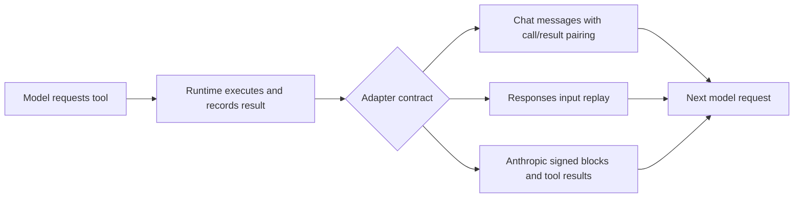

# Models and providers

Model selection is explicit configuration. A connection describes the provider endpoint and credential source; a model identifies the configured capability to use through that connection. The connection ID is durable identity. A display label is presentation.

Configure and enable the connection/model, then select it for an agent. Do not put application model settings in a new `burrow.json` file or edit an immutable release to change an agent's selection. See [Initial setup](../getting-started/initial-setup.md) and [Configuration](../reference/configuration.md).

## Supported adapter paths

| Path | Role | Important behavior |
|---|---|---|
| OpenAI-compatible Chat Completions | Conversational model requests | Role-structured messages and native tool calls/results |
| OpenAI Responses | Conversational model requests | Responses input items and replayed native continuation context |
| Anthropic Messages | Conversational model requests | Content blocks, signed thinking preservation, tool-use/result pairing |
| Generated-artifact adapter | Output-only image/audio generation | Current user generation instruction, without the full conversational prompt or tool loop |
| Google Lyria | Forge music generation | Separate generation dispatch path, not a chat transport |

Adapter selection is based on configured API/capability, not a promise that every remote endpoint implements every feature. [Source: adapter dispatch](https://github.com/NightShaman/Burrow/blob/d6490825401405ce719e007fd96a487c5b0cde56/backend/src/model-adapter.mjs#L22-L29)

### Choosing an API contract

Use the contract actually supported by the provider and model. “OpenAI-compatible” does not automatically imply identical streaming events, tool-call behavior, token limits, or generated-media support.

The OpenAI adapter builds endpoints from the configured base URL/API mode. Recognized ChatGPT backend endpoints have a dedicated Responses request shape: streaming enabled, storage disabled, and unsupported sampling/output-limit fields removed. This is a source-specific compatibility path, not permission to substitute arbitrary credentials between services. [Source: request construction](https://github.com/NightShaman/Burrow/blob/d6490825401405ce719e007fd96a487c5b0cde56/backend/src/model-adapters/openai.mjs#L31-L112)

For a new connection, first validate a simple answer, then a harmless tool call, then any required image or continuation behavior. A plain-text success does not establish complete tool compatibility.

## Credentials and acquisition

Credential type and acquisition flow are different:

- A connection may use an API key, token, or supported OAuth material
- A login/import helper obtains credentials for a supported connection flow
- The provider adapter consumes the resolved credential; it does not make the UI the credential store

The Claude Code helper wraps the installed CLI's `claude auth login --claudeai` flow in a scratch home, tracks status, and supports import/cancellation cleanup. It is not a separate credential type or a model execution engine. See [Authentication](../security/authentication.md) for operator and provider credential boundaries. [Source: Claude login lifecycle](https://github.com/NightShaman/Burrow/blob/d6490825401405ce719e007fd96a487c5b0cde56/backend/src/claude-code-login.mjs#L115-L209)

## Vision and generated output

Image attachments become multimodal content only when the selected model/adapter advertises vision support. The current user message receives the image parts; historical user turns are not all rewritten as image prompts. Without vision, the runtime supplies a textual notice describing the limitation rather than pretending to inspect pixels. [Source: multimodal construction](https://github.com/NightShaman/Burrow/blob/d6490825401405ce719e007fd96a487c5b0cde56/backend/src/runtime-orchestrator.mjs#L163-L245)

Output-only generators receive the current generation instruction and adapter-owned generation options. They do not receive the assembled profile, history, memory, tools, or a conversational follow-up. Generated sources must be persisted before attachment metadata enters the assistant transcript. [Source: generator isolation](https://github.com/NightShaman/Burrow/blob/d6490825401405ce719e007fd96a487c5b0cde56/backend/src/runtime-orchestrator.mjs#L347-L360) [Source: artifact persistence](https://github.com/NightShaman/Burrow/blob/d6490825401405ce719e007fd96a487c5b0cde56/backend/src/runtime-plain-chat-finalizer.mjs#L252-L270)

Use [Forge jobs](workers-tasks.md#background-maintenance-and-generation) when generation should be tracked asynchronously. A listed preview model is a configured compatibility entry, not evidence that the provider currently makes it available to the account.

## Reasoning, sampling, and caching

Reasoning/thought deltas are separate from answer text. Clients must not concatenate them into the final answer or durable assistant message.

Anthropic configuration supports effort controls, adaptive/manual thinking modes, and bounded manual thinking budgets. Prompt caching is enabled by default unless explicitly disabled. Some sampling/effort decisions depend on model-name compatibility rules in the checked-in source. Unsupported or new model names must be tested; do not assume a provider marketing name implies a particular runtime setting. [Source: Anthropic controls](https://github.com/NightShaman/Burrow/blob/d6490825401405ce719e007fd96a487c5b0cde56/backend/src/model-adapters/anthropic.mjs#L110-L229) [Source: model compatibility rules](https://github.com/NightShaman/Burrow/blob/d6490825401405ce719e007fd96a487c5b0cde56/backend/src/anthropic-model-capabilities.mjs#L1-L18)

## Tool continuations

OpenAI Responses continuations replay prepared context rather than relying on `previous_response_id`. Anthropic preserves opaque signed thinking blocks when continuing a tool exchange; a signature-specific rejection can trigger one retry without those thinking blocks. Tool arguments/results still need valid pairing and a supported provider contract. [Source: OpenAI continuation](https://github.com/NightShaman/Burrow/blob/d6490825401405ce719e007fd96a487c5b0cde56/backend/src/model-adapters/openai.mjs#L31-L87) [Source: Anthropic continuation](https://github.com/NightShaman/Burrow/blob/d6490825401405ce719e007fd96a487c5b0cde56/backend/src/model-adapters/anthropic.mjs#L588-L615)

## Context capacity and the meter

The runtime selects and compresses context before calling a model. The current message is kept intact; lower-priority material is reduced, or a request that still cannot fit is rejected.

!!! note "The meter is an estimate"
    Character-based estimates and image allowances are not a provider tokenizer. Some schema and wire fields are not fully represented in the current adapter estimate. Provider telemetry can refine the display, and a run keeps its high-water mark. Do not use the meter as an exact billing count or a guarantee that a provider will accept a request at the advertised limit.

Inspect the current session with `/context` and the redacted provider-ready request with `/context full` where supported by the chat transport. See [Observability](../operations/observability.md), [Runtime architecture](../architecture/runtime.md), and [Known limitations](../project/known-limitations.md). [Source: estimate construction](https://github.com/NightShaman/Burrow/blob/d6490825401405ce719e007fd96a487c5b0cde56/backend/src/model-adapters/adapter-primitives.mjs#L24-L65)

## Failure interpretation

When diagnosing a failed turn, separate connection/authentication failure, model selection failure, unsupported request options, context pressure, stream interruption, tool failure, and missing final synthesis. Preserve the actual error and run ID. Avoid testing with a costly generation request when a harmless text or read-only tool check can establish the broken layer.

Streaming completeness checks differ by adapter, and bounded transport handling is not a blanket guarantee that every truncated provider stream is marked failed. The central [limitations](../project/known-limitations.md) record the source-level caveats; [Troubleshooting](../operations/troubleshooting.md) provides operator procedures.
