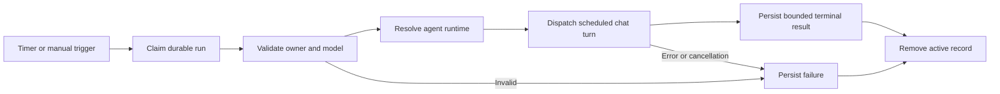

# Workers, tasks, and schedules

BURROW has several forms of work. Choose by the outcome you need, rather than treating every task record as a running agent.

| Surface | Use it for | What starts execution? |
|---|---|---|
| Normal chat run | Interactive work and a current answer | A submitted message |
| Minion | A separate child task with an explicit filesystem target | `spawn_subagent` |
| Peer agent message | Another registered agent's contribution | A reply-request message mode |
| Task board | Track project work, status, priority, and assignment | Assignment alone does not dispatch |
| Scheduled job | A recurring prompt in an agent/session | Scheduler due claim or manual run |
| Forge job | Asynchronous generated media | Explicit generation request |
| Legacy work item | Retained inspect/propose/verify/factory workflow | Explicit continuation control |

## Task board: tracking without automatic dispatch

Native board tools are `tasks_list`, `tasks_create`, `tasks_update`, `tasks_assign`, and `tasks_delete`. A project reference can be an existing project ID or an exact case-insensitive project name. Ambiguous names fail rather than select an arbitrary project.

Creating a task defaults the assignee to the active agent unless an assignee is supplied. A reviewed update can change an existing task, including assigning another known agent. These changes update board metadata; they do not submit the task text as a chat turn. [Source: board tools](https://github.com/NightShaman/Burrow/blob/c15064dd177788afcdda357a5e545510f754a754/backend/src/task-board-tool-executor.mjs)

Example agent tool arguments:

```json
{
  "projectId": "Example application",
  "title": "Add parser edge-case tests",
  "description": "Cover empty input and escaped delimiters.",
  "status": "todo",
  "priority": "normal"
}
```

Supported statuses are `backlog`, `todo`, `in_progress`, `review`, `done`, and `cancelled`; priorities are `critical`, `high`, `normal`, and `low`. Deleting a task is a permanent board mutation. Use a cancelled status when you want to retain its history. [Source: task schemas](https://github.com/NightShaman/Burrow/blob/c15064dd177788afcdda357a5e545510f754a754/backend/src/action-proposal.mjs)

The UI also offers an explicit **Execute** action. Its dispatch uses the assigned agent's `default` conversation and records execution against the task; project paths supply context rather than filesystem grants. Assignment, execution state, and board status remain distinct. The current handler awaits task/project reads and execution updates, and supplies composed stores to the chat runtime. Its acknowledgement is not a terminal receipt: inspect the recorded outcome before considering the task complete. [Source: board execution handler](https://github.com/NightShaman/Burrow/blob/c15064dd177788afcdda357a5e545510f754a754/backend/scripts/burrow-ui.mjs) [Source: asynchronous task lookup](https://github.com/NightShaman/Burrow/blob/c15064dd177788afcdda357a5e545510f754a754/backend/src/postgres-task-board-store.mjs)

See the [API reference](../reference/api.md) for project/task administration and [Persistence](../architecture/persistence.md) for ownership.

## Scheduled jobs

A scheduled job stores a name, prompt, five-field cron expression, timezone, owner agent, and session. Optional model selection can override the model for that job. Agent tools operate only on the active agent's non-mod-owned jobs; they cannot edit another agent's or a mod's jobs.

Agent-created jobs default to disabled unless `enabled` is explicitly true. The default session is the current chat. An omitted timezone is stored as `null`, inheriting the current operator timezone rather than copying its value at creation. The store reconciles inherited schedules after an operator-zone change and recomputes their next occurrence. An explicit IANA timezone keeps that schedule tied to the chosen zone. [Source: job schemas](https://github.com/NightShaman/Burrow/blob/c15064dd177788afcdda357a5e545510f754a754/backend/src/action-proposal.mjs) [Source: agent ownership](https://github.com/NightShaman/Burrow/blob/c15064dd177788afcdda357a5e545510f754a754/backend/src/agent-scheduled-job-tool.mjs)

The cron fields are minute, hour, day of month, month, and weekday (`0` is Sunday; `6` is Saturday). Fields support numbers, `*`, comma-separated lists, numeric ranges, and steps. Named months/weekdays, seconds, and cron macros are not supported. **Every field must match**, including both day of month and weekday when restricted; do not assume the traditional cron OR rule. Next-occurrence calculation skips impossible calendar days and scans eligible UTC minutes within a 366-day horizon and can reject a valid-looking expression with no occurrence in that window. Local daylight-saving gaps or repeats therefore affect which wall-clock occurrences match. [Source: cron parser and matcher](https://github.com/NightShaman/Burrow/blob/c15064dd177788afcdda357a5e545510f754a754/backend/src/scheduled-job-store.mjs) [Source: inherited-zone reconciliation](https://github.com/NightShaman/Burrow/blob/c15064dd177788afcdda357a5e545510f754a754/backend/src/postgres-scheduled-job-store.mjs)

Example preparation of a disabled weekday job:

```json
{
  "name": "Weekday review",
  "prompt": "Review the Example application task board and summarize open blockers.",
  "cron": "0 9 * * 1-5",
  "timezone": "Europe/London",
  "enabled": false
}
```

Review the job before enabling it. A scheduled prompt executes as the configured agent and can select that agent's available tools; scheduling is not inherently read-only.

### Scheduler lifecycle



The scheduler's default interval is 30 seconds, and starting it also performs an immediate tick. Due-claim policy is owned by the store. Dispatch is asynchronous: `scheduled_jobs_run_now` returning successfully means a run was dispatched, not that it finished. Inspect `scheduled_job_runs` for the terminal result.

Due claims are transactional and use row locks plus a unique job/occurrence identity. If the same job already has a `running` run, that due occurrence is recorded as `skipped`. A delayed tick advances the next occurrence from the current time; it does not replay every interval between ticks. At server startup, unfinished run records and past missed occurrences are marked `missed` before scheduling resumes, rather than replayed as a catch-up queue. These outcomes are different from a dispatched run that failed. [Source: due claims](https://github.com/NightShaman/Burrow/blob/c15064dd177788afcdda357a5e545510f754a754/backend/src/postgres-scheduled-job-store.mjs) [Source: restart accounting](https://github.com/NightShaman/Burrow/blob/c15064dd177788afcdda357a5e545510f754a754/backend/src/postgres-scheduled-job-store.mjs)

The scheduler validates model selection and mod-owner availability before dispatch. It prevents a second manual trigger while a running record is found. Cancelling a locally active run aborts its signal; stopping the scheduler timer does not itself cancel active runs. [Source: scheduler](https://github.com/NightShaman/Burrow/blob/c15064dd177788afcdda357a5e545510f754a754/backend/src/scheduled-job-scheduler.mjs)

!!! warning "Verify scheduled dispatch on the installed version"
    The current default scheduled chat dispatch receives the composed stores; the historical injection gap is fixed. This documentation update did not validate a live end-to-end scheduled turn. Inspect each terminal run result and test a harmless job before depending on a schedule.

`BURROW_DISABLE_BACKGROUND_SCHEDULERS=1` (also `true`, `yes`, or `on`) disables background schedulers through the shared environment policy. Consult [Environment variables](../reference/environment.md) and [Configuration](../reference/configuration.md) before changing a service. [Source: scheduler policy](https://github.com/NightShaman/Burrow/blob/c15064dd177788afcdda357a5e545510f754a754/backend/src/background-scheduler-policy.mjs)

## Background maintenance and generation

The curator and Dream subsystems maintain distinct forms of continuity. They are not general task-board workers. Read [Memory](memory.md) and [Dreams](dreams.md) for configuration, lifecycle, and what enters the prompt.

Forge generation is a separate asynchronous job surface: discover available generation models, create a job, inspect it until terminal, then attach a succeeded artifact to the current conversation. Generation may incur provider cost and requires an explicit generation request. The native tool description reports video, source attachments, and provider-specific tuning as unsupported rather than guessing support. [Source: Forge tools](https://github.com/NightShaman/Burrow/blob/c15064dd177788afcdda357a5e545510f754a754/backend/src/forge-agent-tools.mjs)

## Legacy work items and workbench

The compatibility workflow retains four steps:

- `inspect`: a dry-run planning/context path
- `propose`: request a model proposal without executing mutations
- `verify`: run an explicitly supplied verification command
- `factory`: return a commit-workflow preview

Ordinary chat is not automatically converted into this ladder. A work-item continuation requires explicit structured continuation controls; the selected item's session must match unless an internal override explicitly permits cross-session continuation. [Source: workbench steps](https://github.com/NightShaman/Burrow/blob/c15064dd177788afcdda357a5e545510f754a754/backend/src/workbench-runner.mjs) [Source: continuation eligibility](https://github.com/NightShaman/Burrow/blob/c15064dd177788afcdda357a5e545510f754a754/backend/src/work-item-service.mjs)

Read the [CLI wiring caveats](../reference/cli.md#legacy-store-wiring-gap) before using these commands. The raw CLI resolves a model without injecting its required model store, so `model_settings_store_required` can occur before an execution command dispatches. These are retained compatibility surfaces; use the composed HTTP/UI path for ordinary chat. [Source: CLI model resolution](https://github.com/NightShaman/Burrow/blob/c15064dd177788afcdda357a5e545510f754a754/backend/bin/burrow.mjs) [Source: required store](https://github.com/NightShaman/Burrow/blob/c15064dd177788afcdda357a5e545510f754a754/backend/src/config.mjs)
