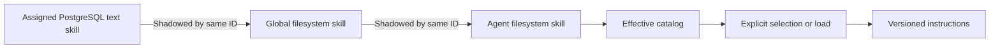

# Extending BURROW

Choose the smallest extension boundary that owns the behavior you need.

| Need | Extension point |
|---|---|
| Reusable operating instructions | Skill |
| Persistent agent identity or environment facts | Profile documents |
| An external service capability | MCP connection and per-agent grants |
| Runtime-integrated tools, routes, or UI contributions | Mod |
| A new provider wire protocol | Model adapter in backend source |

A skill does not install a tool. A discovered tool does not grant itself to an agent. A mod is executable code, not a permissions sandbox.

## Create a filesystem skill

The effective catalog discovers `SKILL.md` recursively under:

```text
<workspaceRoot>/global/skills/<skill-id>/SKILL.md
<workspaceRoot>/<agent-id>/skills/<skill-id>/SKILL.md
```

The containing directory name is the skill ID. A simple frontmatter header supplies the advertised name and description:

```markdown
---
name: Review parser changes
description: Review parser behavior and test coverage using source evidence
---

# Review parser changes

1. Read the changed parser and the relevant tests
2. Identify boundary cases and behavior changes
3. Run the project's documented focused checks when requested
4. Report findings with file references and distinguish tested facts from inference
```

Use simple single-line metadata fields: the current header reader is a bounded, lightweight parser, not a complete YAML processor. Hidden directories are skipped. Catalog discovery reads bounded metadata; the full body is loaded separately and receives a content hash/version. [Source: skill discovery](https://github.com/NightShaman/Burrow/blob/d6490825401405ce719e007fd96a487c5b0cde56/backend/src/skill-catalog.mjs#L29-L94)

### Ownership and precedence



The collision order is explicit: assigned PostgreSQL text, then shared filesystem, then agent filesystem. Disabled skills are unavailable. Experimental and deprecated are lifecycle labels; neither is automatically equivalent to disabled. [Source: catalog precedence](https://github.com/NightShaman/Burrow/blob/d6490825401405ce719e007fd96a487c5b0cde56/backend/src/skill-catalog.mjs#L118-L169)

Only explicitly selected/loaded bodies belong in the prompt. Discovery advertises capabilities and does not infer authority from a matching phrase. Where supplied in the current tool surface, `list_skills` and `load_skill` provide agent-driven discovery/loading. Their current schema availability has a known gating caveat; see [Known limitations](../project/known-limitations.md). [Source: selection boundary](https://github.com/NightShaman/Burrow/blob/d6490825401405ce719e007fd96a487c5b0cde56/backend/src/skill-catalog.mjs#L175-L212)

For asset-bearing packages, keep scripts/templates alongside the filesystem skill. Do not assume a text-only database copy includes those files. Built-in synchronization treats text-only skills and asset packages differently. [Source: workspace defaults](https://github.com/NightShaman/Burrow/blob/d6490825401405ce719e007fd96a487c5b0cde56/backend/src/runtime-workspace-defaults.mjs#L32-L95)

## Add an MCP capability

Use the existing connection/catalog/grant model instead of adding a permanent provider-specific schema to every prompt. The model-facing interface is the stable `mcp_providers`, `mcp_capabilities`, and `mcp_call` menu. The exact discovered tool name and its schema guide invocation; grant checks remain runtime-owned.

Read [MCP](../concepts/mcp.md) for connection setup, tool discovery, encrypted secret ownership, and per-agent grants.

## Build a mod

A mod is discovered under `<runtimeRoot>/mods/<id>/burrow.mod.json`. The manifest ID must match the directory and use lowercase alphanumeric segments separated by hyphens. A name is required; server/UI entrypoints are safe relative paths. `mod-data` is reserved for persistent mod data and is not a discoverable mod package. [Source: manifest discovery](https://github.com/NightShaman/Burrow/blob/d6490825401405ce719e007fd96a487c5b0cde56/backend/src/mod-runtime.mjs#L8-L17) [Source: validation](https://github.com/NightShaman/Burrow/blob/d6490825401405ce719e007fd96a487c5b0cde56/backend/src/mod-runtime.mjs#L103-L139)

Minimal package layout:

```text
example-status/
  burrow.mod.json
  server.mjs
```

`burrow.mod.json`:

```json
{
  "id": "example-status",
  "name": "Example status",
  "server": "server.mjs"
}
```

`server.mjs`:

```javascript
export async function activate(context) {
  context.api.get('/status', async () => ({ ok: true, version: 1 }));

  context.tools.register({
    name: 'example_status',
    description: 'Return the example mod version without reading private data.',
    inputSchema: {
      type: 'object',
      additionalProperties: false,
      properties: {}
    },
    handler: async (args) => {
      if (!args || typeof args !== 'object' || Array.isArray(args)
          || Object.keys(args).length !== 0) {
        throw new Error('invalid_arguments');
      }
      return { ok: true, version: 1 };
    }
  });

  return async () => {
    // Release resources owned by this mod when the host closes it.
  };
}
```

The host imports an `activate(context)` export. Register routes and tools during activation. Activation may return a cleanup function or an object with `close()`. The example advertises a harmless static result; it does not expose host files, credentials, conversation data, or arbitrary process execution. [Source: registrar and activation](https://github.com/NightShaman/Burrow/blob/d6490825401405ce719e007fd96a487c5b0cde56/backend/src/mod-host-child.mjs#L105-L194)

### Validate input in the handler

The catalog's JSON schema advertises the contract, but it is not a substitute for handler validation. Treat tool arguments and route requests as untrusted. The tool handler's second argument contains trusted caller context and an abort signal; do not allow user arguments to redefine those identities.

Use scoped asynchronous settings/secrets APIs rather than inventing files as configuration authority. Additional host APIs expose bounded conversation/model/agent/operator/scheduler capabilities; use only those required by the extension and respect their ownership rules. [Source: host capability context](https://github.com/NightShaman/Burrow/blob/d6490825401405ce719e007fd96a487c5b0cde56/backend/src/mod-host-child.mjs#L153-L205)

!!! warning "Install only trusted mod code"
    A forked host isolates lifecycle and faults; it is not an operating-system or environment sandbox. Installing/enabling a mod and granting an agent a tool are separate actions. Keep secrets out of returned payloads and logs, and review [Trust boundaries](../security/trust-boundaries.md).

Mod tools join the shared MCP catalog as a `mod.<id>` provider. The default registration availability is `grant-required`; do not change it to bypass operator grant decisions. UI contributions can occupy `control`, `settings`, or `archive` slots, with separately validated settings contributions. See the [API reference](../reference/api.md) for installation and lifecycle operations. [Source: tool registration defaults](https://github.com/NightShaman/Burrow/blob/d6490825401405ce719e007fd96a487c5b0cde56/backend/src/mod-host-child.mjs#L118-L128) [Source: UI contributions](https://github.com/NightShaman/Burrow/blob/d6490825401405ce719e007fd96a487c5b0cde56/backend/src/mod-runtime.mjs#L24-L96)

## Extend a model adapter

Provider serialization belongs in the adapter layer, selected by `createModelAdapter`. Preserve the normalized model result shape and native tool IDs, and implement continuation according to the provider's protocol. Keep visible text, thought deltas, artifacts, usage, and errors separate.

A new adapter needs coverage for:

- Plain and role-structured requests
- Tool call/result pairing across multiple rounds
- Multimodal content without accidental string coercion
- Streaming, cancellation, malformed/error responses, and partial results
- Bounded transport reads and safe diagnostic projections
- Context inspection and estimates
- Final text or explicit incomplete/failure outcomes

Use controlled provider fixtures, not live paid endpoints, for repeatable tests. Review [Models](../concepts/models.md) and [Execution flow](../architecture/execution-flow.md) before changing this boundary. [Source: adapter facade](https://github.com/NightShaman/Burrow/blob/d6490825401405ce719e007fd96a487c5b0cde56/backend/src/model-adapter.mjs#L1-L29)

## Development checklist

1. Choose the owner: instruction, profile, tool integration, mod, or provider transport
2. Validate inputs and preserve trusted caller/state boundaries
3. Produce bounded outputs with clear failure and truncation behavior
4. Test activation, rejection, cancellation, failure, cleanup, and repeated calls
5. Confirm disabled/ungranted capabilities remain unavailable
6. Update the affected contract/reference documentation alongside the code
7. Build and validate a new release rather than editing the active release in place

Use [Development setup](setup.md), [Repository structure](repository.md), and [Release engineering](releases.md) for the supported source/build workflow.
