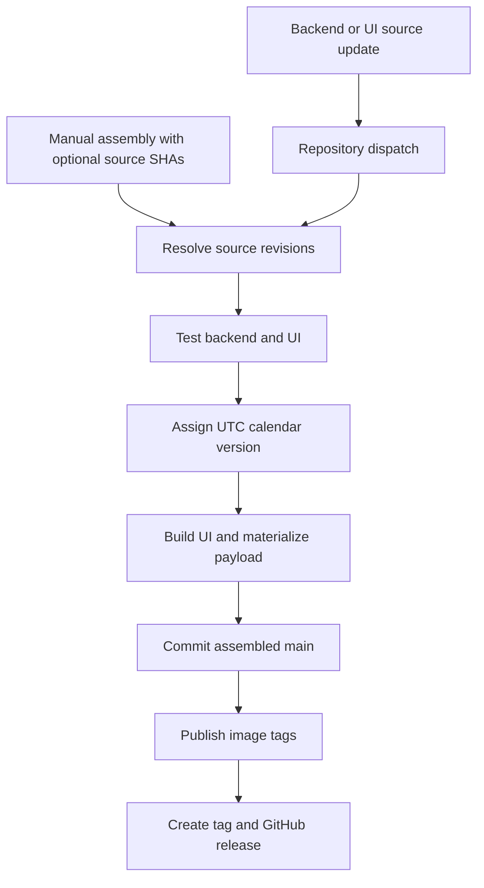

# Releases

The public assembly owns the Burrow release version, generated application payload, image publication, and release tag.

## Assembly flow

The workflow serializes public-main publishers to avoid competing assemblies. It resolves source revisions, checks out the current publishing branch, verifies both source test suites, builds the UI, copies the allowlisted payload, and writes `SOURCE_VERSIONS`.

## Version and image identifiers

The base version is the assembly date in UTC: `YYYY.MM.DD`. If occupied by the current build, an existing release, or a tag, a numeric suffix is added: `.1`, `.2`, and so on.

The workflow publishes:

- `ghcr.io/nightshaman/burrow:latest`
- `ghcr.io/nightshaman/burrow:<calendar-version>`
- `ghcr.io/nightshaman/burrow:sha-<assembled-commit>`

The Git tag is `v<calendar-version>`. The reviewed baseline has [release v2026.10.02.7](https://github.com/NightShaman/Burrow/releases/tag/v2026.10.02.7).

Do not assume a release contains a separate core application tarball asset. Core native installation consumes the assembled repository archive; containers consume the published image. Release notes and attached optional assets are not a substitute for inspecting the core installer path.

## What triggers a build

Public assembly responds to `source-updated` repository dispatch and manual workflow dispatch. The source repositories' current workflows run tests and send a dispatch after pushes; they use the source commit SHA. Public docs changes belong to their own workflow and must not invoke deployment or runtime update commands.

Assembly uses Node24; the pinned source notification workflows use Node22. That CI difference is source evidence, not a recommendation to lower the native runtime's Node24 requirement.

## Publication is not runtime activation

These are different states:

1. A source commit exists
2. Assembly tests/build succeed
3. Public generated commit and image are published
4. A release tag/record exists
5. An operator updates a particular installation
6. That installation reports the intended version and passes acceptance checks

The user's runtime does not become updated merely because a source commit or release exists. Native operators run `burrow update`; container operators replace their image. See [upgrades](../operations/upgrades.md).

## Release review checklist

- Backend/UI pins match the intended changes
- Required source checks succeeded for those pins
- Generated public payload is coherent with its source map
- Image and release identifiers match the assembled commit/version
- Installation, upgrade, and recovery implications are described
- Database migration compatibility is understood
- Documentation build/link checks pass for the updated manual

The existing assembly does not by itself prove a production upgrade or rollback rehearsal. Keep build evidence distinct from deployment evidence.

## Source evidence

- [Canonical assembly workflow](https://github.com/NightShaman/Burrow/blob/d6490825401405ce719e007fd96a487c5b0cde56/.github/workflows/assemble.yml)
- [Reviewed source revisions](https://github.com/NightShaman/Burrow/blob/2d979fecca8434fe02a6ed2e8225c46eb4690098/SOURCE_VERSIONS)
- [Native immutable archive resolution](https://github.com/NightShaman/Burrow/blob/d6490825401405ce719e007fd96a487c5b0cde56/install.sh#L248-L289)
