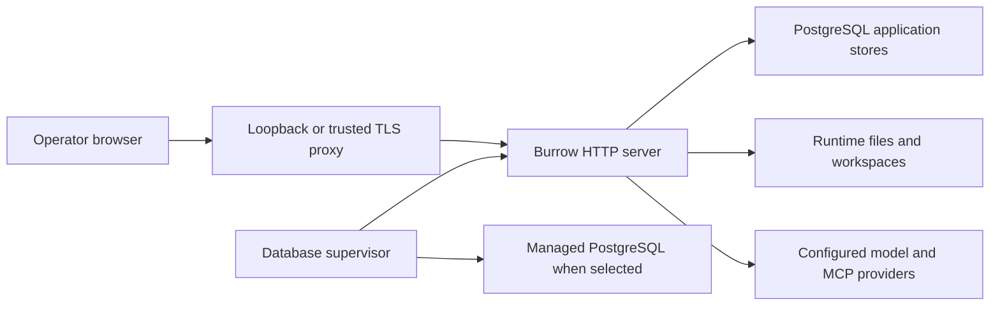

# Deployment

Use one replaceable application and one clearly owned durable-state root. Keep the database, encryption key, and filesystem artifacts recoverable together.

## Supported deployment shapes

| Shape | Application | Database lifecycle | Normal entry point |
|---|---|---|---|
| Native user install | `<home>/.burrow/app` | Managed PostgreSQL 17 or external | Installed `bin/burrow` launcher |
| Container | `/opt/burrow` | Managed PostgreSQL 17 or external | Container entrypoint/supervisor |
| Development checkout | Explicit source tree | Operator-provided isolated database | Development commands, never a live-user runtime |



See [native installation](../getting-started/installation.md) or [containers](containers.md). A PostgreSQL lifecycle mode describes who starts/stops PostgreSQL; it does not select a different persistence backend.

## Native user service

A fresh default install creates, enables, and starts the persistent user service automatically. The complete automatic setup path is Ubuntu with systemd and a non-root installation owner with sudo access. After installation:

```sh
"$HOME/.burrow/bin/burrow" service status
"$HOME/.burrow/bin/burrow" service logs -n 100
```

The launcher loads `burrow.env`, locates its own installation, and starts the PostgreSQL supervisor. The user unit is installed below `~/.config/systemd/user` unless `XDG_CONFIG_HOME` overrides it. Lingering is required for persistence across logout/reboot; installation enables and verifies it, with a sudo fallback if needed. The installer waits for HTTP readiness and verifies the installed application version through this normal supervisor path.

Use `sh install-burrow.sh --no-service` for foreground use or your own supervisor. Development installs with `--no-install-dependencies` also skip automatic service setup. To add the persistent service later, run `burrow service install`. Existing managed installations are updated/restarted without re-enabling a disabled service, while existing manual installations remain manual.

Run service management as the installation owner. Do not mix a foreground `serve` process and a user service on the same port. Historical system-wide unit examples in supporting source are not the default installer workflow.

## Network exposure

Fresh native installs bind `127.0.0.1:42817`. Direct script and container startup can bind all interfaces. Confirm the effective listener instead of assuming every path has the native installer default.

For remote use:

1. Configure a supported [authentication mode](../security/authentication.md)
2. Use TLS termination at a trusted reverse proxy
3. Restrict direct access to the backend listener with host/network controls
4. Forward authenticated identity headers only from explicitly trusted proxy addresses
5. Disable response buffering for streaming chat and allow sufficiently long requests
6. Restrict the public `/health` route if its runtime details should not be exposed

Trusted-proxy allowlists use exact observed peer addresses, not arbitrary CIDR ranges or client-provided forwarding headers. Burrow's HTTP authentication is not per-tenant isolation and does not constrain the OS privileges of agent tools.

## External PostgreSQL

Provision an operator-owned PostgreSQL **17** database with `vector` installed. The application account needs privileges to run Burrow's schema migration pipeline. External startup verifies major version and extension availability; it does not create the extension or take over database shutdown.

For a native install, place external settings in the intended install root's private `burrow.env` before installation/update. Use the [environment reference](../reference/environment.md) for complete names and precedence:

```dotenv
BURROW_POSTGRES_LIFECYCLE=external
BURROW_POSTGRES_HOST=db.example.internal
BURROW_POSTGRES_PORT=5432
BURROW_POSTGRES_DATABASE=burrow
BURROW_POSTGRES_USER=burrow
BURROW_POSTGRES_SSL_MODE=verify-full
```

Supply the password through the protected environment, and configure `BURROW_POSTGRES_SSL_CA_FILE` only if a private certificate authority requires it. Do not paste real values into documentation or commit the file. Preserve the installation's `BURROW_SETTINGS_KEY`.

A connection URL can be used instead of individual connection fields. Do not mix SSL query parameters in that URL with explicit TLS mode settings; the validator rejects ambiguous combinations. System trust roots are used with verified TLS when no custom CA is supplied.

External backups are the database owner's responsibility. A local filesystem archive cannot contain an external database. See [backup and recovery](backup-recovery.md).

## Startup and shutdown

The supervisor prepares PostgreSQL and migration state before starting the HTTP application. The server composes stores, loads supported extension infrastructure, synchronizes bundled skills, and then listens. Background schedulers and interrupted-run recovery initialize after the listener starts.

Normal shutdown records active-run interruption evidence and drains connections before closing stores. `BURROW_SHUTDOWN_DRAIN_MS` defaults to 10 seconds, with a one-second minimum. Allow the supervisor to shut down a managed database cleanly; avoid killing database processes during ordinary service maintenance.

## Acceptance checklist

- Correct application version and source pins recorded
- One expected listener/process, with intended exposure and authentication
- Correct database mode, version, extension, and storage permissions
- Matching private encryption key retained
- A model-backed chat completes for the intended agent
- A recent backup has been restored in an isolated rehearsal
- Logs and retention have explicit owners

## Source evidence

- [Native service and activation](https://github.com/NightShaman/Burrow/blob/d6490825401405ce719e007fd96a487c5b0cde56/install.sh#L480-L613)
- [Supervisor](https://github.com/NightShaman/Burrow/blob/d6490825401405ce719e007fd96a487c5b0cde56/backend/scripts/postgres-supervisor.mjs)
- [External database validation](https://github.com/NightShaman/Burrow/blob/d6490825401405ce719e007fd96a487c5b0cde56/backend/src/postgres-lifecycle.mjs#L105-L133)
- [Connection and TLS configuration](https://github.com/NightShaman/Burrow/blob/d6490825401405ce719e007fd96a487c5b0cde56/backend/src/postgres-foundation.mjs#L15-L61)
- [Server startup/shutdown](https://github.com/NightShaman/Burrow/blob/d6490825401405ce719e007fd96a487c5b0cde56/backend/scripts/burrow-ui.mjs#L3290-L3371)
