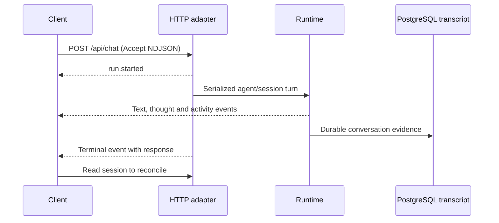

# Chat and streaming

`POST /api/chat` submits one user-visible turn. Select an existing agent; its configured model and tools determine what the turn can do. A request can incur provider charges and execute granted tools.

## Request body

| Field | Behavior |
|---|---|
| `agentId` | Registered agent; explicit selection is recommended |
| `sessionId` | Session name, default `default` |
| `message` | Nonblank string; an image attachment permits an image-only request |
| `runId` | Optional caller-supplied run identifier; absence generates one, not a general idempotency key |
| `attachments` | Array of `{name, type, size, encoding, content}` records |
| `modelConnectionId`, `model` | Optional exact enabled connection/model overrides |
| `reasoningEffort`, `temperature` | Per-turn generation preferences, subject to model support |
| `continuityScope` | Explicit continuity namespace; `workingProject` is a compatibility alias |
| `noCallModel` | Literal `true` selects no-model behavior; not an authorization or sandbox control |

Normal chat does not accept a workspace-selection/execution-target protocol. A continuity namespace or prose path does not change the tool cwd or execution target. Requests sharing an agent/session are serialized by the HTTP adapter.

### Attachment and request budgets

The browser defaults to **8 MiB per file**, **16 MiB per attachment batch**, and **8 files**. These are pre-read browser resource budgets, not server admission policy. Deployments can override positive integer values through `window.__BURROW_CLIENT_BUDGETS__` before loading the UI bundle. [Browser budgets](https://github.com/NightShaman/Burrow/blob/c15064dd177788afcdda357a5e545510f754a754/ui/src/app/clientBudgets.ts)

The server separately truncates non-image attachment content to 200,000 characters and rejects image content above 30,000,000 characters with 413. Its JSON request reader defaults to **96 MiB** total body bytes and **30 seconds** for body receipt; `BURROW_REQUEST_MAX_BYTES` and `BURROW_REQUEST_TIMEOUT_MS` configure those ceilings. JSON traversal is also bounded. None of these limits proves native PDF/Office parsing from a filename or guarantees that all attachment text reaches the model. [Server request budgets](https://github.com/NightShaman/Burrow/blob/c15064dd177788afcdda357a5e545510f754a754/backend/src/request-resource-budgets.mjs)

[Input normalization](https://github.com/NightShaman/Burrow/blob/c15064dd177788afcdda357a5e545510f754a754/backend/src/chat-turn-controller.mjs) · [HTTP validation/serialization](https://github.com/NightShaman/Burrow/blob/c15064dd177788afcdda357a5e545510f754a754/backend/scripts/burrow-ui.mjs)

## NDJSON protocol

Send `Accept: application/x-ndjson` to receive newline-delimited JSON over the POST response. The response uses HTTP 200 and `application/x-ndjson; charset=utf-8`, with `no-cache, no-transform` and `x-accel-buffering: no`. It is not Server-Sent Events.

Each event has `type`, `runId`, `sessionId`, `ts` and `data`. Buffer partial network chunks until a complete line is available, parse each JSON line independently and ignore unknown event types safely.

| Event | Meaning |
|---|---|
| `run.started` | Accepted runtime turn and run identifier |
| `route.decided` | Route/session-kind observation |
| `model.started`, `model.completed` | Model request/response metadata |
| `assistant.delta` | Provisional answer text; `data.delta`, `totalChars`, `modelCall` |
| `assistant.thought` | Separate provisional thought stream; never merge it into the final answer |
| `tool.started`, `tool.completed` | Tool activity/status and selected presentation fields |
| `verification.completed` | Verification observation |
| `runtime.notice` | Runtime loop warning/block notice |
| `run.completed` | Terminal `data.response`; inspect its application outcome |
| `run.failed`, `run.cancelled`, `run.superseded` | Other terminal outcomes with `data.response` |

The terminal response and persisted transcript are authoritative, not accumulated deltas. A handled unsuccessful result can arrive in `run.completed`, and an HTTP 200 stream can end with failure. Slash-command turns can produce only a terminal event. Early validation failures can be ordinary JSON errors before streaming starts.

Tool progress is operational evidence, not a content-free telemetry guarantee: projected fields can include command, cwd, paths, query, reason and error. Keep streams private.

[NDJSON and progress projection](https://github.com/NightShaman/Burrow/blob/c15064dd177788afcdda357a5e545510f754a754/backend/scripts/burrow-ui.mjs) · [Terminal handling](https://github.com/NightShaman/Burrow/blob/c15064dd177788afcdda357a5e545510f754a754/backend/scripts/burrow-ui.mjs)

## Disconnect and cancellation

Closing the browser or aborting the client fetch marks the turn detached; it does not automatically cancel execution. Send `POST /api/chat/{runId}/cancel` with the owning `agentId` and optional `reason` for explicit cancellation. Cancellation is a request to stop active work, not rollback of tools already executed.

After a disconnect, query `GET /api/chat/runs/active` with `agentId`/`sessionId`, then reload [session history](sessions.md). Active-run state is in memory and is not a durable streaming replay cursor. There is no automatic resumption of the same event stream. Avoid blindly reposting a turn, which can run it twice.

[Detach/cancel implementation](https://github.com/NightShaman/Burrow/blob/c15064dd177788afcdda357a5e545510f754a754/backend/scripts/burrow-ui.mjs) · [Cancel route](https://github.com/NightShaman/Burrow/blob/c15064dd177788afcdda357a5e545510f754a754/backend/scripts/ui/chat-routes.mjs)

## Steering an active turn

`POST /api/chat/{runId}/steer` submits new user input to a run. Supply its owning `agentId`, exact `sessionId`, a nonblank `idempotencyKey`, and `message` (or supported image attachment input). `GET /api/chat/{runId}/steering?agentId=...&sessionId=...` reads the durable submissions and their status. Both routes use the normal API authentication boundary.

| Status | Meaning |
|---|---|
| `pending` | Stored, waiting for a runtime boundary |
| `delivered` | Handed into the model continuation and recorded for prompt replay |
| `follow_up` | Run stopped accepting input before delivery; not automatically sent as a new turn |

A successful POST confirms storage, not delivery or completion of the requested work. Poll steering status and inspect the resulting transcript. Inputs are delivered at runtime boundaries; steering does not undo a tool already executed. Reuse an idempotency key only for an identical retry: changed payloads return 409 `steering_idempotency_conflict`. A reset generation mismatch returns 409 `chat_run_session_reset`; an unknown run returns 404 `chat_run_not_found`. Stopping the run or recovering after the server no longer has it active can leave input marked `follow_up`; review it before explicitly sending a new turn to avoid duplicated work.

[Steering routes](https://github.com/NightShaman/Burrow/blob/c15064dd177788afcdda357a5e545510f754a754/backend/scripts/ui/chat-routes.mjs) · [HTTP submission/status](https://github.com/NightShaman/Burrow/blob/c15064dd177788afcdda357a5e545510f754a754/backend/scripts/burrow-ui.mjs) · [Durable steering contract](https://github.com/NightShaman/Burrow/blob/c15064dd177788afcdda357a5e545510f754a754/backend/src/postgres-live-run-steering.mjs)

## Endpoint inventory

Methods are significant. Braced segments are placeholders; URL-encode identifiers. See the [contract and conventions](../api.md) for artifact limitations.

| Method | Path | Purpose |
|---|---|---|
| `POST` | `/api/chat` | Run one chat turn |
| `GET` | `/api/chat/runs/active` | List active chat runs |
| `POST` | `/api/chat/{runId}/cancel` | Cancel a chat run |
| `POST` | `/api/chat/{runId}/steer` | Submit idempotent steering input |
| `GET` | `/api/chat/{runId}/steering` | Read durable steering input/status |
