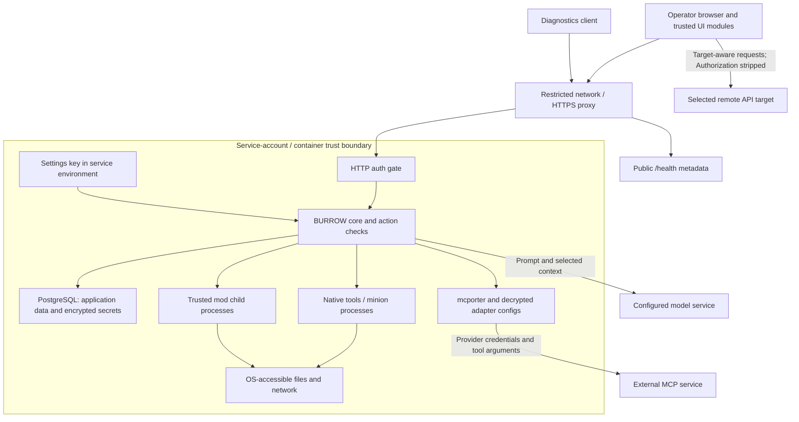

# Trust boundaries

BURROW is an operator-controlled runtime with native filesystem/process tools, model connections, MCP integrations, and installable code. Deploy it inside a trust boundary suitable for the data and credentials available to its service account. HTTP login, encrypted settings, and child processes each provide specific protections; together they do not establish hostile multi-tenant isolation.

This page describes source-verified behavior at commit `2d979fecca8434fe02a6ed2e8225c46eb4690098` (**2026.10.02.7**). Live network, identity-provider, database, and host isolation must be verified in the actual deployment.

## Boundary map

The host box is a deployment trust boundary, not a claim that the components inside it are sandboxed from one another. The public health branch bypasses interactive authentication. Remote target selection changes the destination of target-aware UI requests; it does not create a credential or tenant-isolation contract. See [Authentication](authentication.md) and [Permissions](permissions.md) for the concrete checks.

## Secrets at rest

`BURROW_SETTINGS_KEY` must base64-decode to exactly 32 bytes. Model/provider authentication, MCP secrets, UI OIDC client secrets, mod secrets, and private mod-source credentials use AES-256-GCM with fresh 12-byte nonces and authentication tags. Associated data binds ciphertext to its secret/connection/mod/source identity, with distinct format prefixes. Some decryptors accept historical prefixes for compatibility.

This protects the designated secret records, not every database field or every file. Conversation text, ordinary settings, browser caches, generated artifacts, and generic traces are not automatically encrypted by the settings-secret mechanism. A running process with the settings key can decrypt the records it can access. An environment-provided credential already exists in plaintext in that environment.

[Source: key requirements and model encryption](https://github.com/NightShaman/Burrow/blob/d6490825401405ce719e007fd96a487c5b0cde56/backend/src/model-settings-store.mjs#L68-L74) · [Source: model encryption envelope](https://github.com/NightShaman/Burrow/blob/d6490825401405ce719e007fd96a487c5b0cde56/backend/src/model-settings-store.mjs#L219-L237) · [Source: MCP encryption](https://github.com/NightShaman/Burrow/blob/d6490825401405ce719e007fd96a487c5b0cde56/backend/src/mcp-settings-store.mjs#L10-L29) · [Source: OIDC encryption](https://github.com/NightShaman/Burrow/blob/2d979fecca8434fe02a6ed2e8225c46eb4690098/backend/src/ui-auth-secrets.mjs#L3-L24) · [Source: mod encryption](https://github.com/NightShaman/Burrow/blob/d6490825401405ce719e007fd96a487c5b0cde56/backend/src/postgres-mod-store.mjs#L21-L42) · [Source: source-credential encryption](https://github.com/NightShaman/Burrow/blob/d6490825401405ce719e007fd96a487c5b0cde56/backend/src/mod-distribution.mjs#L89-L103)

### Preserve the settings key

The native installer preserves or creates a settings key in its private service environment. The container persists it in `${BURROW_SETTINGS_KEY_FILE:-$BURROW_RUNTIME_ROOT/config/settings.key}` and refuses startup when an explicitly supplied key differs from the saved one. Preserve the matching key and database together; replacing the key is not a repair for decryption errors and is not a complete rotation procedure. [Source: native key preservation](https://github.com/NightShaman/Burrow/blob/d6490825401405ce719e007fd96a487c5b0cde56/install.sh#L439-L476) · [Source: container key lifecycle](https://github.com/NightShaman/Burrow/blob/d6490825401405ce719e007fd96a487c5b0cde56/docker-entrypoint.sh#L4-L31)

See [Backup and recovery](../operations/backup-recovery.md) for coordinated database/filesystem backups. Encryption does not make an incomplete or inconsistent backup recoverable.

### MCP adapter files contain decrypted credentials

The database is the settings authority, but `mcporter` needs a materialized configuration. BURROW creates its runtime configuration directory with mode `0700` and writes credential-bearing JSON files with mode `0600`:

- `ephemeral`: a temporary configuration is removed after the operation
- `keep_alive`: a stable `runtime/mcp-{id}.json` is retained for the daemon; stop/reconciliation removes it when appropriate

HTTP API keys become provider `Authorization: Bearer` headers. Stdio provider configuration includes the service `PATH` plus explicitly configured provider environment variables. File modes restrict other OS users under normal ownership; they do not hide secrets from the same account or trusted installed code. Review permissions on existing directories as well as newly created files. [Source: config materialization and lifecycle](https://github.com/NightShaman/Burrow/blob/d6490825401405ce719e007fd96a487c5b0cde56/backend/src/mcporter-adapter.mjs#L182-L257)

The current server keeps sanitized MCP lifecycle events in PostgreSQL, but its one-time legacy import also preserves the complete original JSONL text in a separate receipt. Unknown fields and malformed lines in that raw receipt are not guaranteed redacted. Protect database backups accordingly. [Source: lifecycle import](https://github.com/NightShaman/Burrow/blob/2d979fecca8434fe02a6ed2e8225c46eb4690098/backend/src/postgres-mcp-provider-state-store.mjs#L39-L61)

## Redaction has a defined scope

BURROW's redaction is boundary-driven:

- Structured fields with recognized sensitive names, such as `password`, `apiKey`, `authorization`, and `refreshToken`, are replaced
- Explicit `<secret>…</secret>` blocks in free text are replaced
- Known exact protected values can be replaced when the caller supplies them to redaction
- Traversal and text budgets limit output size

Ordinary prose that resembles a credential assignment is deliberately not heuristically rewritten. A result labeled `clear` by the protected-value adapter means no supported protected declaration was found; it is not a guarantee that the content contains no secrets. [Source: redaction rules](https://github.com/NightShaman/Burrow/blob/d6490825401405ce719e007fd96a487c5b0cde56/backend/src/redaction.mjs#L1-L50) · [Source: protected output](https://github.com/NightShaman/Burrow/blob/d6490825401405ce719e007fd96a487c5b0cde56/backend/src/protected-values.mjs#L217-L268)

Generic trace payload handling bounds content but does not apply blanket redaction. Different producers apply different projections. Chat progress can include commands, paths, queries, reasons, and errors, and diagnostics access includes private-content endpoints. Inspect and sanitize the actual material before sharing logs, trace artifacts, transcripts, or screenshots. [Source: trace bounding](https://github.com/NightShaman/Burrow/blob/d6490825401405ce719e007fd96a487c5b0cde56/backend/src/trace-logger.mjs#L25-L64) · [Source: progress projection](https://github.com/NightShaman/Burrow/blob/d6490825401405ce719e007fd96a487c5b0cde56/backend/scripts/burrow-ui.mjs#L1757-L1792) · [Diagnostics scope](authentication.md#exact-allowlist)

## Installed mods are trusted code

A mod server runs in a Node child process. The host owns lifecycle, availability, RPC routing, and access through the mod-scoped settings/secrets APIs. The `fork` call does not configure a separate OS user, filesystem/network sandbox, or sanitized environment. It inherits the service environment. A child process failure boundary is therefore not a security boundary against hostile code. [Source: child launch](https://github.com/NightShaman/Burrow/blob/d6490825401405ce719e007fd96a487c5b0cde56/backend/src/mod-host.mjs#L95-L103)

Core-owned APIs keep normal mod operations scoped and explicit. Mod HTTP projections strip `authorization`, `cookie`, `proxy-authorization`, and `x-api-key` headers and provide verified `enabled`/`authenticated` booleans. This protects that particular API projection; it does not remove the host/environment powers of installed JavaScript. [Source: mod HTTP projection](https://github.com/NightShaman/Burrow/blob/d6490825401405ce719e007fd96a487c5b0cde56/backend/src/mod-runtime.mjs#L333-L370)

Mod UI code is also trusted: it is dynamically imported into the operator page and mounts into DOM surfaces. Scoped API helpers, namespace validation, cleanup handlers, and error boundaries are useful contracts, not an iframe sandbox. Review a source's code and dependencies before installation or update, even when its tools have no agent grants. [Source: UI module import](https://github.com/NightShaman/Burrow/blob/d6490825401405ce719e007fd96a487c5b0cde56/ui/src/features/settings/ModSettingsHost.tsx#L116-L151) · [Extensions](../development/extensions.md)

### Child environments differ

Do not generalize one subprocess's environment policy to another:

| Process path | Environment behavior |
|---|---|
| Native shell harness | Defaults to `PATH` and `HOME` plus explicit values; full inheritance is an explicit option |
| Local minion runner | Allowlist includes runtime paths, settings key, and PostgreSQL connection credentials |
| Mod child host | Inherits service environment through the default Node `fork` behavior |
| MCP stdio provider definition | Service `PATH` plus explicitly configured provider values |

None of those environment choices alone changes the process's OS file or network permissions. [Source: native shell](https://github.com/NightShaman/Burrow/blob/d6490825401405ce719e007fd96a487c5b0cde56/backend/src/harness/exec.mjs#L39-L60) · [Source: minion allowlist](https://github.com/NightShaman/Burrow/blob/d6490825401405ce719e007fd96a487c5b0cde56/backend/src/subagent-process-runner.mjs#L18-L31) · [Source: MCP environment](https://github.com/NightShaman/Burrow/blob/d6490825401405ce719e007fd96a487c5b0cde56/backend/src/mcporter-adapter.mjs#L182-L195)

## Browser and remote UI trust

The UI stores entered Basic credentials only in module memory, but the server also issues a browser session cookie. Separately, browser-local storage can retain drafts and conversation turns. Closing a tab or clearing the in-memory Basic value does not prove those other data stores have been cleared. Use a trusted browser profile and protect shared devices. [Source: Basic memory](https://github.com/NightShaman/Burrow/blob/d6490825401405ce719e007fd96a487c5b0cde56/ui/src/app/auth.ts#L1-L14) · [Source: browser storage](https://github.com/NightShaman/Burrow/blob/d6490825401405ce719e007fd96a487c5b0cde56/ui/src/app/browserStorage.ts#L14-L52) · [Source: draft cache](https://github.com/NightShaman/Burrow/blob/d6490825401405ce719e007fd96a487c5b0cde56/ui/src/features/chat/chatDraftCache.ts#L6-L43) · [Source: transcript cache](https://github.com/NightShaman/Burrow/blob/d6490825401405ce719e007fd96a487c5b0cde56/ui/src/features/chat/chatConversationCache.ts#L23-L60)

Target-aware requests to a target with a base URL explicitly remove the `Authorization` header. The current remote-target contract has no inherited credential scheme, and local Basic credentials are not forwarded. This does not make the destination trustworthy or mean every browser credential behavior is replaced by that header filter. Select only trusted target URLs, confirm the intended owner before actions, and use HTTPS.

Local mod discovery, contributed Settings APIs, and Archive mounts coexist with active-target-aware operations. Selecting a remote target does not relocate every UI operation. See the [Interface guide](../concepts/interface.md) for local/remote ownership and [Known limitations](../project/known-limitations.md) for cache and contract caveats. [Source: target transport](https://github.com/NightShaman/Burrow/blob/d6490825401405ce719e007fd96a487c5b0cde56/ui/src/app/api.ts#L340-L374)

## Safe deployment checklist

These are operator controls to apply and verify; they are not a claim of built-in hardening.

- [ ] Set the actual listener/bind address and firewall rules for the entrypoint in use; do not expose `none` mode to an untrusted network
- [ ] Use HTTPS for browser and remote API access; verify secure cookie behavior, especially the Basic cookie limitation
- [ ] For trusted-proxy auth, restrict backend reachability to exact trusted peers and replace inbound identity headers
- [ ] For OIDC, set the public callback URI, trusted issuer, and intended email/domain restrictions; retain secure cookies
- [ ] Restrict `/health` where runtime paths and configuration metadata should not be public
- [ ] Add appropriate request-size/rate limits and browser-origin/CSRF defenses at the deployment boundary; CORS alone does not supply them
- [ ] Use a least-privilege service account, narrow mounts, and explicit network access; keep unrelated secrets out of its reach
- [ ] Review model/MCP endpoints, provider credential scopes, and the exact agent tool grants before use
- [ ] Treat mods and their UI modules as trusted executable code, including updates and transitive dependencies
- [ ] Protect the settings key, PostgreSQL state, runtime integration files, and browser profile; test a coordinated restore
- [ ] Give diagnostics tokens an appropriate expiry, review recipients, and revoke unused tokens; do not equate read-only with content-free
- [ ] Review actual logs/traces before sharing and test authentication from outside the trusted network as well as through the normal proxy

Read [Deployment](../operations/deployment.md), [Configuration](../reference/configuration.md), [Environment variables](../reference/environment.md), and the [API reference](../reference/api.md) for implementation-specific setup. The [Known limitations](../project/known-limitations.md) page records additional static gaps; live validation is still required for the deployed system.
